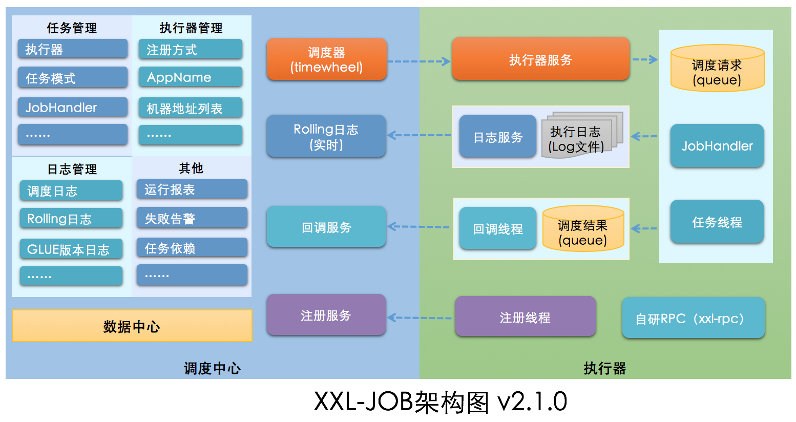
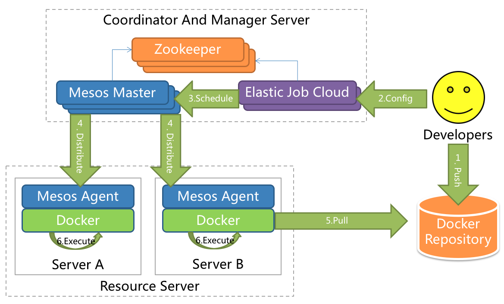
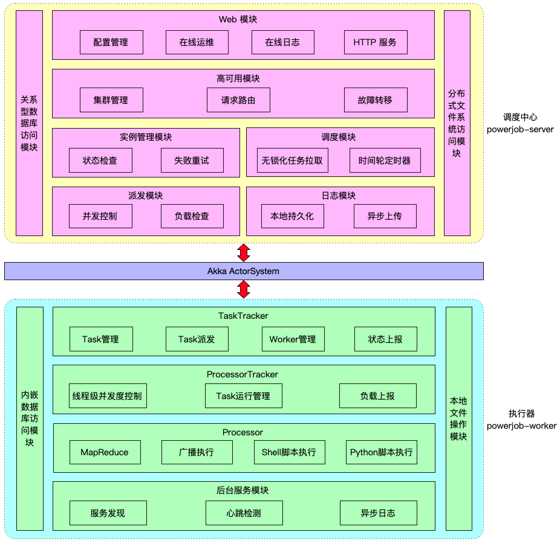
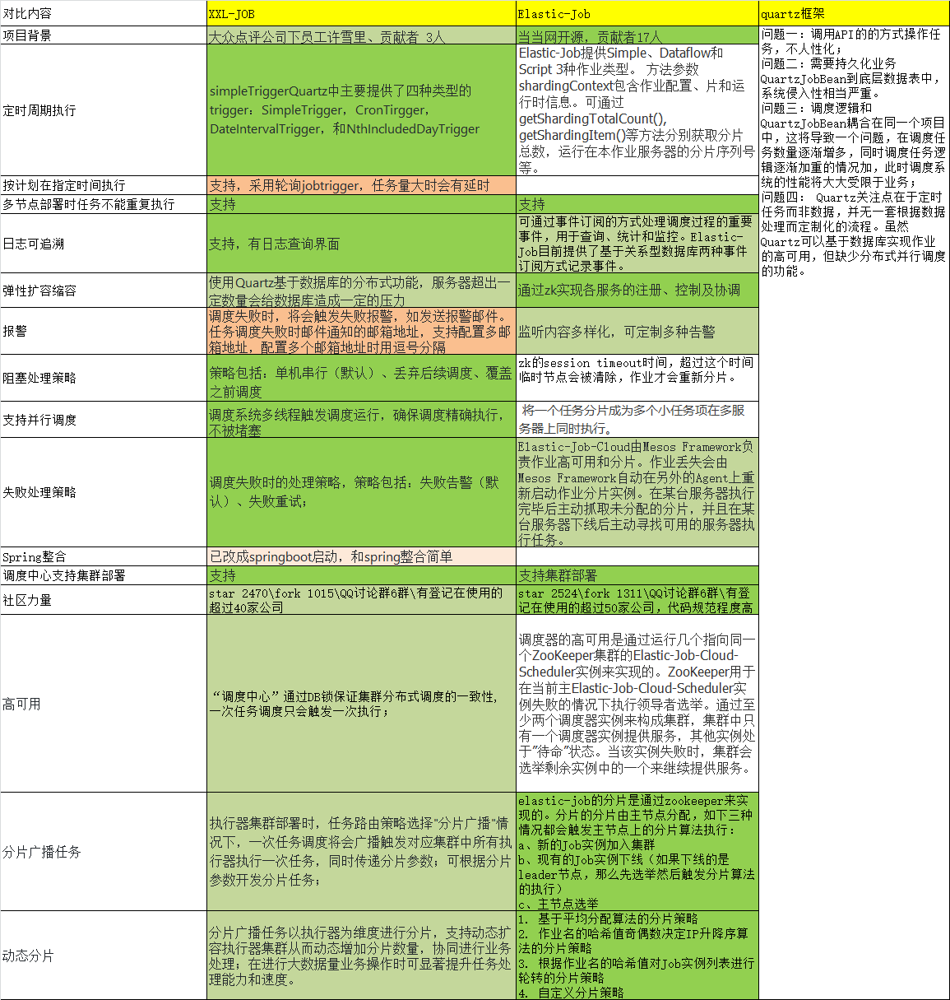

# 一. 目标与计划

## 一. 背景与意义

### **1. 需求背景**

**在满足伪直播系统转码调度需求的同时，提供通用的任务调度平台**，可用于其他项目（例：精品课视频中心）

主要执行临时性任务，如视频处理（例：剪辑、转码、加密）、伪直播推流

### **2. 使用场景**

- 1.x（已上线）：学习成长中心（）、小班课（）
- 2.x（计划中）：伪直播转码（）、视频中心

### **3. 优势与收益**

#### **3.1 相关系统**

##### **（1）task board**

伪直播系统当前使用的任务调度框架。无中心，以 zk 为主库进行任务的存储和发布，执行节点在 zk 上创建临时节点抢占执行任务。

使用者：伪直播转码

- ###### **系统优势：**

1. 修改性。任务的发布和执行解耦，容易添加新的任务类型和节点。系统只曝露任务类型和任务参数，但不处理任务执行逻辑；执行节点订阅特定的任务类型，并领取任务开始执行。
2. 可用性。系统组件只有 zk，zk 为多点部署以提升可用性。注：目前 zk 为物理机部署，且由 soda 团队管理；如遇到物理机故障，响应和恢复速度相对较慢。

- ###### **系统缺陷：**

1. zk 不适合作为数据库。zk 性能有限，适合存储少量元数据，用于选主等场景；但是不适合存储大量业务数据（例：精品课视频中心）。
2. 无中心，执行节点自行抢占执行任务，无法优化任务调度算法。

##### **（2）soda scheduler 1.x**

基于 k8s job 的任务调度框架，用于执行视频处理类临时任务。系统采用主从架构，主节点常驻，执行任务时临时创建 k8s job（相当于从节点），实例化该任务类型的镜像用于执行任务。系统计算各个任务的总体资源占用，防止创建过多 job 耗尽 k8s 资源。

使用者：学习成长中心（）、小班课（）

- ###### **系统优势：**

1. 修改性。任务调度和任务执行解耦，容易添加新的任务类型（并配置对应的镜像）。注：需要配置系统内部数据库，因此由 soda 团队维护数据库内容，其他团队无法自助操作。
2. 可用性。系统部署在 k8s，解决了物理机单点故障的问题。注：数据库为物理机部署，存在问题同上。
3. 调度策略（性能）。系统支持调度策略（优先级、FIFO），能够控制任务执行顺序。注：对于伪直播场景，现有调度策略仍有不足，需要开发其他机制。
4. 资源占用（性能）。系统计算总体资源占用，有节制地创建 k8s job，避免耗尽资源。
5. 数据库性能。相比于 task board，系统使用数据而非 zk 存储任务，以防 zk 成为性能瓶颈。

- ###### **系统缺陷：**

1. 可用性。目前的任务执行是尽力而为的，遇到异常时（例：创建 k8s job 失败，或者 k8s job 执行失败）不存在重试等恢复手段。其根本原因在于主从节点之间没有建立通信，使得主节点无法感知任务执行状态。**这个问题主要影响伪直播推流的可用性。**
2. 实时性（性能） 。如遇到 k8s 资源不足，系统创建 k8s job 时会延迟，**影响伪直播推流等任务的实时性**。
3. 运维。系统调用 k8s API，其鉴权 key 需要经常更新，并需要人工操作，无法做到无人值守。有替代方案。
4. 代码质量（修改性）。系统调用 k8s API，使用了三方依赖 fabric 客户端。该客户端 API 设计质量差，难以捕获和处理特定的边界情况，代码中打补丁非常晦涩；线程模型不支持纯异步。此外，k8s API 存在未知行为（现已查明），已经引起过2次故障导致系统无法工作，但不确定是否仍存在其他未知行为。

#### **3.2 scheduler 2.x设计思想**

当前系统（soda scheduler 2.x）借鉴相关系统的优势，并解决设计缺陷。系统仍然采用主从架构，主节点完成任务调度但不承担业务逻辑；主节点将任务分配给从节点，从节点执行具体逻辑。系统支持多种任务类型的从节点，并允许动态添加。

**针对现有系统的设计缺陷，soda scheduler 2.x优化了从节点的部署和通信方式**：

1. **从节点的部署方式**：从 k8s job 改为 k8s workload，即临时任务改为常驻进程。从节点 workload 需要预先创建，在系统内注册并接受任务分配；一个从节点同时只执行一个任务，但空闲后可分配新的任务。

workload 在创建时即已占用资源，规避了临时创建 job 时资源不足的问题。开发者可以对 workload 扩缩容，控制任务执行的资源占用；而主节点的资源调度算法可以简化，不再需要计算总体资源占用，只需将任务分配给空闲的从节点。

1. **主从通信方式**：从节点向主节点建立长连接，并双向通信。主节点向从节点发送消息，以分配任务；从节点向主节点发送消息，以更新任务状态（中间状态或最终结果）。由于主从节点间建立了通信，主节点可以监控任务执行状态，并在任务遇到异常时进行重试恢复，直至成功。注：平台只能采用“至少一次”的执行策略，无法透明地支持幂等性；以防任务重复执行，从节点的开发者需要在任务逻辑中进行去重，如跳过已经完成处理的视频。

此外，主从节点直接通信，而不再依赖 k8s API，从而规避了鉴权问题，以及三方依赖中的未知问题。

#### **3.3** **系统组成**

- **主节点（调度中心）：**

负责管理调度信息，按照调度配置发出调度请求，自身不承担业务代码。调度系统与任务解耦，提高了系统可用性和稳定性，同时调度系统性能不再受限于任务模块；

- **从节点（执行器）：**

负责接收调度请求并执行任务逻辑。任务模块专注于任务的执行等操作，开发和维护更加简单和高效

## **二. 计划与收益**

| **分析维度**                                                 | **任务调度平台2.x开发计划** | **计划版本**                                                 | **应用场景**                                                 |
| ------------------------------------------------------------ | --------------------------- | ------------------------------------------------------------ | ------------------------------------------------------------ |
| **功能**                                                     | P0 任务 CRUD                | 2.0                                                          | 从节点注册新的执行器以支持任务类型，不需要修改调度框架的代码 |
| P1 动态控制任务运行状态                                      | 2.2                         | 动态修改任务状态、启动/停止任务，以及终止运行中任务，即时生效 |                                                              |
| P2 任务触发（例：定时、人工、API）                           | 2.2                         | 例：伪直播推流，可以预定执行节点在指定时刻进行推流。         |                                                              |
| **可修改性**                                                 | P0 从节点注册               | 2.0                                                          | 例：视频转码（伪直播服务）、视频剪辑（精品课视频中心）       |
| **可用性**                                                   | P0 从节点可用性             | 2.0                                                          |                                                              |
| P0 任务执行可用性                                            | 2.1a                        | （例：分配超时、执行异常），应当重试执行                     |                                                              |
| P0 任务执行幂等性。任务如重复执行多次，效果应当和执行一次相同 | 2.1a                        | 例：转码任务的幂等性。任务代码在转码结束时，将文件上传至 OSS；如文件存在则不重复上传，从而实现幂等性。 |                                                              |
| P0 任务执行超时                                              | 2.1a                        | 例：伪直播转码任务必须在指定时长内完成                       |                                                              |
| **可观测性**                                                 | P1 任务执行状态/进度        | 2.1b                                                         |                                                              |
| P2 执行节点日志                                              | 2.1b                        |                                                              |                                                              |
| P2 任务调度历史记录                                          | 2.1b                        |                                                              |                                                              |
| P1 告警（例：邮件、popo）                                    | -                           |                                                              |                                                              |
| P2 报表汇总                                                  | -                           |                                                              |                                                              |
| **伸缩性**                                                   | P2 主节点扩容               | -                                                            |                                                              |
| P1 从节点扩容                                                | 2.0                         |                                                              |                                                              |
| P2 从节点路由                                                | 2.2                         |                                                              |                                                              |
| **性能**                                                     | P0 任务执行削峰             | 2.0                                                          |                                                              |
| P2 复杂任务调度策略                                          | 2.2                         | 紧急任务优先执行，如必要则预留资源                           |                                                              |
| P0 基本任务调度策略                                          | 2.0                         | 调度策略：优先级、先到先得                                   |                                                              |
| P0 线程模型                                                  | 2.0                         |                                                              |                                                              |
| P0 任务执行全异步化设计                                      | 2.0                         | 任务调度流程全异步化设计实现，如异步调度、异步运行、异步回调等，有效对密集调度进行流量削峰，理论上支持任意时长任务 |                                                              |
| **信息安全**                                                 | P2 权限管理                 | -                                                            |                                                              |
| P2 加密通信                                                  | -                           | 提供任务执行 SDK，无外部依赖，比 spring 更通用               |                                                              |
| **易用性**                                                   | P2 spring 支持              | -                                                            |                                                              |
| P2 运维平台                                                  | -                           |                                                              |                                                              |

备注：2.1a、2.1b，分别表示可用性和可观测性，可以独立地开发和测试，不用等 2.1 完全完成开发。

**v2.0**

**【目的】**

1. 打通基本能力，完成任务的提交、调度、分配、执行、通知，提供任务调度能力；
2. 从节点执行相应的任务类型，而不需要修改系统代码，将任务与调度解耦，提升系统可修改性；
3. 实现客户端 API 及从节点 SDK；在此基础上实现伪直播转码任务，供使用者联调

**【收益】**

1. 打通系统架构的主流程，解决 scheduler 1.x 的设计缺陷；
2. 参与实际项目联调，避免阻塞开发进度；

**【****预计上线时间****】**

预计参与联调时间：2023.09.15

前置资源：贵阳生产环境

**v2.1**

**【****目的****】**

**1. 进一步提升系统可用性，提升系统稳定性**

1. 任务遇到异常可以重试执行，直至成功，保证任务“至少一次”的执行，降低系统故障率；
2. 保证重试执行的幂等性。例如：伪直播转码任务需配合修改，上传转码结果文件时，需判断文件是否存在

**2. 实现系统可观测性，降低后期运维成本**

1. 人可以观察任务执行过程，了解发生故障的环节，快速定位故障点；
2. 人可以了解系统负载，对从节点进行扩缩容，节省资源，提升系统吞吐量，降低后期运维成本；

**【收益】**

**优化非功能需求，达到生产标准，提升系统稳定性，降低运维成本**

**【****预计上线时间****】**

预计参与联调时间：（7-10天）

**v2.2**

**【****目的****】**

**细化并提升系统的任务调度能力，满足更多复杂场景下的任务调度**

1. 控制任务状态。例：停止正在执行的任务
2. 定时执行。例：伪直播定时推流
3. 执行节点路由。例：预留节点资源，保证紧急任务及时开始

**【收益】**

**满足更多复杂场景下的任务调度，如伪直播推流等**

**预计上线时间**

预计参与联调时间：（预计两周）

# 二. 竞品调研

## **一. 开源任务调度平台对比**

从项目背景、功能特点、技术架构、阻塞处理、可用性、稳定性、生态、动态分片等方面进行详细对比的分析

[产品对比参考](https://help.aliyun.com/document_detail/161984.html?spm=a2c4g.148187.0.0.d19d61a341x466)

| **对比内容** | **XXL-JOB**                                                  | **ElasticJob**                                               | **PowerJob**                                                 | **优缺点**                                                   |                                                              |
| ------------ | ------------------------------------------------------------ | ------------------------------------------------------------ | ------------------------------------------------------------ | ------------------------------------------------------------ | ------------------------------------------------------------ |
| 功能特性     | 主要功能                                                     | 操作：支持通过Web页面对任务进行CRUD操作；动态：支持动态修改任务状态、启动/停止任务，以及终止运行中任务，即时生效；调度中心（中心式）：调度采用中心式设计，支持集群部署；执行器（分布式）：任务分布式执行，支持集群部署；注册中心: 执行器会周期性自动注册任务, 调度中心将会自动发现注册的任务并触发执行。同时，也支持手动录入执行器地址；任务进度监控：支持实时监控任务进度；Rolling实时日志：支持在线查看调度结果，并且支持以Rolling方式实时查看执行器输出的完整的执行日志；执行器任务GLUE：提供Web IDE，支持在线开发任务逻辑代码，动态发布，实时编译生效，省略部署上线的过程。支持30个版本的历史版本回溯。脚本任务：支持以GLUE模式开发和运行脚本任务，包括Shell、Python、NodeJS、PHP、PowerShell等类型脚本;命令行任务：原生提供通用命令行任务Handler（Bean任务，”CommandJobHandler”）；业务方只需要提供命令行即可；任务依赖：支持配置子任务依赖，当父任务执行结束且执行成功后将会主动触发一次子任务的执行, 多个子任务用逗号分隔； | 定时任务：基于Quartz cron执行定时任务；作业注册中心：基于Zookeeper和其客户端Curator实现的全局作业注册控制中心。用于注册，控制和协调分布式作业执行。作业分片：将一个任务分片成为多个小任务项在多服务器上同时执行。支持多种作业执行模式：支持OneOff，Perpetual和SequencePerpetual三种作业模式。运行时状态收集： 监控作业运行时状态，统计最近一段时间处理的数据成功和失败数量，记录作业上次运行开始时间，结束时间和下次运行时间。多线程快速处理数据：使用多线程处理抓取到的数据，提升吞吐量。Spring支持：支持spring容器，自定义命名空间，支持占位符。运维平台：提供运维界面，可以管理作业和注册中心。 | 提供前端Web CURD定时策略完善：支持 CRON 表达式、固定频率、固定延迟和API四种定时调度策略。**工作流支持，**任务进行编排依赖精简：**最小仅依赖关系型数据库**调度服务器，一改其他调度框架基于数据库锁的策略，实现了无锁化调度。部署多个调度服务器可以同时实现高可用和性能的提升（支持无限的水平扩展） | **ElasticJob：**需要引入zookeeper，mesos，增加系统复杂度，学习成本较高。**XXL-JOB：**调度中心通过获取DB锁来保证集群中执行任务的唯一性； |
| 技术架构     |  |  |  |                                                              | [两者对比参考](https://blog.csdn.net/m0_37337849/article/details/97755987) |
| 可用性       | 依赖                                                         | mysql，jdk1.7+，maven3.0+                                    | jdk1.7+，zookeeper3.4.6+，maven3.0.4+，mesos                 |                                                              |                                                              |
| 阻塞处理策略 | 任务超时控制：支持自定义任务超时时间，任务运行超时将会主动中断任务；任务失败重试：支持自定义任务失败重试次数，当任务失败时将会按照预设的失败重试次数主动进行重试；其中分片任务支持分片粒度的失败重试；任务失败告警；默认提供邮件方式失败告警，同时预留扩展接口，可方便的扩展短信、钉钉等告警方式；路由策略：执行器集群部署时提供丰富的路由策略，包括：第一个、最后一个、轮询、随机、一致性HASH、最不经常使用、最近最久未使用、故障转移、忙碌转移等； | 作业停止，恢复和禁用：用于操作作业启停，并可以禁止某作业运行（上线时常用）。被错过执行的作业重触发：自动记录错过执行的作业，并在上次作业完成后自动触发。可参考Quartz的misfire。 |                                                              |                                                              |                                                              |
| 弹性扩缩容   | 弹性扩容缩容：一旦有新执行器机器上线或者下线，下次调度时将会重新分配任务；触发策略：提供丰富的任务触发策略，包括：Cron触发、固定间隔触发、固定延时触发、API（事件）触发、人工触发、父子任务触发； | 弹性调度支持任务在分布式场景下的分片和高可用能够水平扩展任务的吞吐量和执行效率任务处理能力随资源配备弹性伸缩资源分配在适合的时间将适合的资源分配给任务并使其生效相同任务聚合至相同的执行器统一处理动态调配追加资源至新分配的任务 |                                                              |                                                              |                                                              |
| 稳定性       | 失败处理策略                                                 | 调度过期策略：调度中心错过调度时间的补偿处理策略，包括：忽略、立即补偿触发一次等；阻塞处理策略：调度过于密集执行器来不及处理时的处理策略，策略包括：单机串行（默认）、丢弃后续调度、覆盖之前调度；故障转移：任务路由策略选择”故障转移”情况下，如果执行器集群中某一台机器故障，将会自动Failover切换到一台正常的执行器发送调度请求。一致性：“调度中心”通过DB锁保证集群分布式调度的一致性, 一次任务调度只会触发一次执行； | 失效转移： 运行中的作业服务器崩溃不会导致重新分片，只会在下次作业启动时分片。启用失效转移功能可以在本次作业执行过程中，监测其他作业服务器空闲，抓取未完成的孤儿分片项执行。容错处理：作业服务器与Zookeeper服务器通信失败则立即停止作业运行，防止作业注册中心将失效的分片分项配给其他作业服务器，而当前作业服务器仍在执行任务，导致重复执行。 |                                                              |                                                              |
| 部署与告警   | 容器化：提供官方docker镜像，并实时更新推送dockerhub，进一步实现产品开箱即用；线程池隔离：调度线程池进行隔离拆分，慢任务自动降级进入”Slow”线程池，避免耗尽调度线程，提高系统稳定性；用户管理：支持在线管理系统用户，存在管理员、普通用户两种角色；权限控制：执行器维度进行权限控制，管理员拥有全量权限，普通用户需要分配执行器权限后才允许相关操作；数据加密：调度中心和执行器之间的通讯进行数据加密，提升调度信息安全性；邮件报警：任务失败时支持邮件报警，支持配置多邮件地址群发报警邮件；运行报表：支持实时查看运行数据，如任务数量、调度次数、执行器数量等；以及调度报表，如调度日期分布图，调度成功分布图等；全异步：任务调度流程全异步化设计实现，如异步调度、异步运行、异步回调等，有效对密集调度进行流量削峰，理论上支持任意时长任务的运行； | 幂等性：重复作业任务项判定，不重复执行已运行的作业任务项。由于开启幂等性需要监听作业运行状态，对瞬时反复运行的作业对性能有较大影响。 |                                                              |                                                              |                                                              |
| 高可用性     |                                                              | 分片广播任务：执行器集群部署时，任务路由策略选择”分片广播”情况下，一次任务调度将会广播触发集群中所有执行器执行一次任务，可根据分片参数开发分片任务；动态分片：分片广播任务以执行器为维度进行分片，支持动态扩容执行器集群从而动态增加分片数量，协同进行业务处理；在进行大数据量业务操作时可显著提升任务处理能力和速度。自定义任务参数：支持在线配置调度任务入参，即时生效；调度线程池：调度系统多线程触发调度运行，确保调度精确执行，不被堵塞； | 可视化管控端作业管控端作业执行历史数据追踪注册中心管理       |                                                              |                                                              |
| 生态         |                                                              | [文档](https://www.xuxueli.com/xxl-job/) [XXL开源社区](https://www.xuxueli.com/page/community.html) | [官网](https://shardingsphere.apache.org/elasticjob/)[文档](https://shardingsphere.apache.org/elasticjob/current/cn/overview/)https://github.com/dangdangdotcom/elastic-job[参考链接](https://www.cnblogs.com/wyb628/p/7682580.html) |                                                              |                                                              |
|              |                                                              |                                                              |                                                              |                                                              |                                                              |

​                    

**分析维度**

- 功能
- 修改性：系统需要支持多种不同类型任务；支持新的任务类型时，尽量减少对系统现有代码的修改
- 可用性：系统预测故障时，能恢复工作。需考虑主节点、从节点的机器故障，以及任务遇到的故障
- 可观测性：了解任务运行状态
- 伸缩性：增减系统内的节点数，以提升系统性能/节约资源
- 性能：任务的调度和执行策略
- 信息安全：避免未授权的访问和修改
- 易用性：降低人操作系统的难度

**主从分离**：系统采用主从架构进行职责分离，以提升伸缩性和修改性。主节点只负责任务调度，不关注具体任务逻辑；从节点专注于任务的执行、监控，无需关注任务调度细节。

- **伸缩性：**从节点是可插拔的，无需系统重启即可动态添加从节点，以添加新的任务类型，或增加某种任务类型的节点数。
- **修改性：**从节点是开放的，使用者可针对具体业务开发从节点并添加到系统中。

| **分析维度**                                                 | **需求**                                                     | **soda任务调度平台**                                         | **竞品**                                                     |
| ------------------------------------------------------------ | ------------------------------------------------------------ | ------------------------------------------------------------ | ------------------------------------------------------------ |
| **功能**                                                     | P0 任务 CRUD。任务有多种类型，同类任务每次执行可填写不同的入参 | √                                                            | √                                                            |
| P1 动态控制任务运行状态                                      | 主节点向从节点通信，控制任务状态                             | **xxl job**：√**elastic job**：√。                           |                                                              |
| P? 脚本任务（例：shell、python）                             | 待定如需要，可以注册新的执行器。                             | **xxl job**：web IDE、shell、py、node js、PHP                |                                                              |
| P? 任务编排（例：DAG、map reduce）                           | 多个步骤应当作为一个任务，不提供“编排”能力。例：伪直播任务，包含一个暖场视频和一个主播视频；任务根据当前时刻是否开课，决定播出那个视频。该任务是自含的，拆分为两个子任务进行编排反而增加复杂性。例：上课录播剪辑，对一段完整视频截取若干片段进行拼接，然后依次转不同分辨率。以上为一个完整的业务逻辑，业务方开发任务代码时可以提供一个完整的代码段，而无需被迫拆分为 x 个裁剪任务、y 个拼接任务、z 个转码任务。 | **xxl job**顺序执行多个任务，逗号分隔**elastic job**分片作业模式：OneOff、Perpetual、SequencePerpetual（不理解） |                                                              |
| P? 任务触发（例：定时、人工、API）                           | 待定例：伪直播推流，可以预定执行节点在指定时刻进行推流。执行节点在同一时段只能执行一个任务，但可以预定多个任务处于不重叠的时段。 | **xxl job**：cron、延时、人工、API**elastic job**：quartz cron 自动记录错过执行的作业 |                                                              |
| **可修改性**                                                 | P1 执行器注册。在系统中添加新的执行器以支持任务类型，不需要修改调度框架的代码例：视频转码（伪直播服务）、视频剪辑（精品课视频中心） | 主节点公开对外域名，从节点向主节点注册，以接受任务           | **xxl job**注册中心，执行器定期注册自己，或人工配置执行器地址**elastic job**注册中心（zk） |
| **可用性**                                                   | P0 主节点可用性                                              | 主节点部署方式为 k8s pod，挂掉后可以重启                     | **xxl job**：集群部署**elastic job**：？                     |
| P0 从节点可用性                                              | 从节点部署方式为 k8s workload，主节点可以向任一 pod 提交任务 | **xxl job**：故障转移**elastic job**：失效转移               |                                                              |
| P0 任务执行可用性。任务如遇到可恢复异常（例：提交超时、执行异常），应当重试执行 | 主节点在数据库中记录任务状态，未完成的任务会反复重试提交到从节点执行。任务结束时，从节点通知主节点，主节点再在数据库中更新任务状态，从而结束执行。 | **xxl job**：提交超时、重试次数                              |                                                              |
| P1 任务执行幂等性。任务如重复执行多次，效果应当和执行一次相同 | 主节点保证任务执行至少一次，任务代码保证幂等性。理论上幂等性不存在透明实现，任务代码必须配合，不可能仅依靠主节点实现幂等性。例：转码任务的幂等性。任务代码在转码结束时，将文件上传至 OSS；如文件存在则不重复上传，从而实现幂等性。 | **xxl job**一致性：通过 DB 锁，任务只执行一次。（不可能实现，除非任务代码配合实现幂等性。例：任务执行完成时发生故障，但还没有在数据库中记录任务状态；此时如重试执行任务，就会发生重复执行）**elastic job**作业服务器与Zookeeper服务器通信失败则立即停止作业运行，防止作业注册中心将失效的分片分项配给其他作业服务器，而当前作业服务器仍在执行任务，导致重复执行。重复作业任务项判定，不重复执行已运行的作业任务项。（不理解。是至少一次还是至多一次？） |                                                              |
| P0 任务执行超时。例：伪直播转码任务必须在指定时长内完成      | 待定                                                         | **xxl job**：超时中断                                        |                                                              |
| **可观测性**                                                 | P1 任务执行状态/进度                                         | 从节点向主节点通信，汇报任务状态；同时，主节点将任务状态写入数据库，可被外部查询 | **xxl job**：√**elastic job**：√                             |
| P2 执行节点日志                                              | k8s pod 日志                                                 | **xxl job**：Rolling实时日志                                 |                                                              |
| P2 任务调度历史记录                                          | 主节点、从节点访问数据库，写入监控事件                       | **xxl job**：在线查看调度结果                                |                                                              |
| P? 告警（例：邮件、popo）                                    | 待定。可以在任务代码中实现；调度平台提供常用告警方式的 SDK   | **xxl job**：邮件、短信、钉钉、自定义                        |                                                              |
| P? 报表汇总                                                  | 待定                                                         | **xxl job**任务数、调度次数、失败次数等，及其日期分布**elastic job**成功、失败次数 |                                                              |
| **伸缩性**                                                   | P2 主节点扩容                                                | （暂未考虑）主观认为：主节点调度负载不高，目前不需要横向扩展。 |                                                              |
| P1 从节点扩容                                                | 从节点部署方式为 k8s workload，可以随时扩缩容。新创建的 pod 会向主节点注册，从而开始接受任务。 | **xxl job**弹性扩容缩容：新上线的节点可接受新的任务。（这个不叫“弹性扩缩容”。“弹性”指的是预先部署少量节点，当负载变大时自动增加节点数）**elastic job**分片、水平扩展mesos 资源管理 |                                                              |
| P? 从节点路由                                                | 待定。暂不需要，任一执行节点，都能执行同类型的任务           | xxl job：轮询、LRU、LFU、hash……elastic job：相同（含义？）任务聚合至同一执行器 |                                                              |
| **性能**                                                     | P0 任务执行削峰                                              | 一个从节点同一时刻只执行一个任务。主节点了解从节点执行任务的情况，从节点满载后，多余的任务在数据库中排队，暂不开始执行。 | **xxl job**异步调度削峰阻塞策略：单机串行、丢弃后续调度、覆盖之前调度。（不是很理解含义） |
| P1 任务调度。紧急任务优先执行，如必要则预留资源              | “紧急”标签                                                   |                                                              |                                                              |
| P? 线程模型                                                  | 待定。预计：1.纯异步。任务代码完成后，向 promise 通知结果2.单线程。从节点同一时刻只执行一个任务；在一个特定的线程中执行任务，任务方法返回视为任务结束。 | **xxl job**多线程慢任务线程隔离，避免全局阻塞**elastic job**多线程（我们不需要多线程，横向增加从节点数目即可；每个从节点同时只执行一个任务，无需考虑线程隔离，使用异步或单线程模型即可。结合超时机制，及时中止任务释放节点） |                                                              |
| **信息安全**                                                 | P? 权限管理                                                  | 待定                                                         | **xxl job**用户类型：普通、管理员                            |
| P? 加密通信                                                  | 待定IM SDK 支持 SSL                                          | xxl job：加密通信                                            |                                                              |
| **易用性**                                                   | P? spring 支持                                               | 提供任务执行 SDK，无外部依赖，比 spring 更通用               | xxl job：springelastic job：spring                           |
| P2 运维平台                                                  | 待定                                                         | xxl job：√elastic job：√                                     |                                                              |

# 三. 系统设计

## **一. 系统架构**

### **1.系统角色**

#### **1.1** **客户端**

系统的使用者。

向系统提交任务（例：视频转码、视频推流），系统按一定策略执行任务并通知结果。

#### 1.2 主节点（调度中心）

任务管理和调度，负责管理任务调度信息，但不承担具体任务的执行。

和客户端直接交互，接受客户端提交任务进行永久存储；并将现有任务按调度策略，分配给某个从节点执行。

#### 1.3 从节点（执行器）

执行具体任务逻辑。

每个从节点只能执行特定类型的任务，同类型任务的从节点可以有多个；一个从节点同时只执行一个任务。

### **2 通信方式**

系统对外使用 http 通信，提供 http API 提交任务，以及通过 http 回调通知结果；

系统内部，主从节点之间使用 IM SDK 进行双工通信 IM SDK

IM SDK 此处指 soda-im-sdk，参见：[1.快速开始](https://docs.popo.netease.com/lingxi/d90e178dfbfe4e7f83f09d35c2a3ecf1)

### **3 设计思想**

**主从分离**：系统采用主从架构进行职责分离，以提升伸缩性和修改性。主节点只负责任务调度，不关注具体任务逻辑；从节点专注于任务的执行、监控，无需关注任务调度细节。

- **伸缩性：**从节点是可插拔的，无需系统重启即可动态添加从节点，以添加新的任务类型，或增加某种任务类型的节点数。
- **修改性：**从节点是开放的，使用者可针对具体业务开发从节点并添加到系统中。

**IM SDK**：系统内主从节点的通信方式为 IM SDK。IM SDK 支持双工通信，提供可靠传输能力。

- 双工通信：主节点和从节点都可以主动发送消息，适用于分配任务、上报任务状态等场景。
- 可靠传输：IM SDK 自动完成网络重连、消息重传，上层无需对每条消息都处理网络异常。具体而言，SDK 内部使用选择重传协议（默认），每条消息都被标识、确认、重传，从而在提交给上层时保证顺序性和完整性。

可靠性对比：IM SDK vs 原生 TCP/http

- IM SDK：即使单向消息也能保证可靠性，无需设计响应消息。SDK 底层已完成消息的确认和重传，上层无需重复设计可靠传输机制。
- 原生 TCP/http：即使双向消息（请求-响应），也无法保证可靠性。每次通信都需要考虑请求丢失、响应丢失、消息传输超时等异常情况。

## **二. 工作流程**

**1. 任务提交**：客户端向主节点提交任务，指定任务类型、任务参数；系统支持多种任务类型，同类任务每次执行可填写不同的入参。

**2. 任务存储：**主节点将提交的任务及记录在数据库中永久存储，以及从数据库中读出待执行的任务；实现层面，在内存中建立数据库缓存并定期更新，每次读取数据库中取出一部分最早待执行的任务进行缓存；提交/更新任务时，同时修改内存以及写入数据库。

**3. 任务调度：**主节点按照调度策略选择将要执行的下一个任务（如有），以及执行该任务的从节点；

调度策略决定任务执行的顺序，系统内同时只能执行有限个任务；常见策略包括优先级、时间顺序、标签。

- 优先级：优先级高的任务先执行
- 时间顺序：提交更早的任务先执行
- 标签：从节点和任务可以添加标签，仅当标签满足特定条件才能执行任务。例：一部分从节点标记为“紧急”，这些节点预留资源，仅当任务也标记为“紧急”时才能分配给这些节点执行。

**3a.节点状态：**从节点定期上报状态，如任务类型、在线状态、执行任务的状态；主节点选择在线的、空闲的从节点，用于执行对应任务类型的下一个任务。

**4.任务分配**：主节点向从节点发送要执行的任务，包括任务类型、任务参数等。

**4a.从节点任务分配：**从节点可以接受任务分配并开始执行任务，也可以拒绝执行任务（或响应超时），使得主节点重新调度和分配。主节点反复执行上述过程，直至任务被某个从节点接受。

特定边界情况下，可能有多个从节点被分配同一个任务，因此从节点的任务代码必须保证幂等性。例：从节点执行视频转码并上传 OSS；上传时不要覆盖现有文件，以防任务被分配、执行多次。

**5.任务执行和监控**：从节点执行被分配的任务，并主动 5a.上报任务状态（如需要），任务完成后上报任务结果，主节点接收任务状态，并在数据存储中更新，任务完成后，主节点通过 http 回调通知任务结果，并在数据存储中删除任务。

任务状态可以用于监控，也可以用于控制任务执行

例：一个转码任务需要执行多个视频文件的转码，上报任务状态表示当前已经完成了哪个文件的转码

任务状态可以用于监控，使得使用者了解当前转码进度

如任务发生故障并重新执行，则任务状态也可以恢复上一次的转码进度，避免重复转码已经完成的文件，节约执行耗时

## **三. 功能特性**

## **四. 代码架构设计**

1. **用户接口层（access）：**负责处理与外部系统的交互，包括Http、Web API、RPC接口等。接收用户或外部系统的请求，然后调用应用层的服务来处理这些请求，最后将处理结果返回给用户或外部系统，主要包含controller和View Object。
2. **应用层（application）：**承担协调领域层和基础设施层的职责，实现具体的业务逻辑。它调用领域层的领域服务和基础设施层的基础服务，完成业务逻辑的实现，主要包含service。
3. **领域层（domain）：**包含业务领域的所有元素，如实体、值对象、领域服务、聚合、工厂和领域事件等。这一层的主要职责是实现业务领域的核心逻辑。
4. **基础设施层（infrastructure）：**主要提供通用的技术能力，如数据持久化、缓存、消息传输等基础设施服务。它可被其他三层调用，提供各种必要的技术服务。

另外有三种数据模型：实体对象（Entity）、数据对象（Data Object，DO）和数据传输对象（Data Transfer Object，DTO）

- Entity（实体对象）：
- Data Object （DO、数据对象）：和数据库表对应
- DTO（数据传输对象）：

这三种数据对象在很多场景下需要相互转换，例如：

1. Entity <**一一**> DTO

DTO Assembler

1. Entity <**一一**>  DO

Data Converter

# 四. 通信协议与接口

## **一. 通信流程**

### **1. 任务提交**

**1.1**  客户端向主节点提交任务，指定任务类型、任务参数，目前版本只支持API方式提交任务；

**1.2** 任务提交响应：主节点对客户端提交的任务请求进行解析和校验；

### **2. 任务存储**

**2.1** 主节点将提交的任务及记录在数据库中永久存储；

**2.2** 主节点从数据库中读出待执行的任务；

实现层面，在内存中建立数据库缓存并定期更新，每次读取数据库中取出一部分最早待执行的任务进行缓存；提交/更新任务时，同时修改内存以及写入数据库。

### **3. 任务调度**

3.1 任务调度：主节点按照调度策略选择将要执行的下一个任务（如有），以及执行该任务的从节点；

3.2 从节点状态

### **4. 任务分配**

### **5. 任务执行与监控**

## **二.通信格式**

### **2.1 任务提交与存储**

客户端和主节点通信，使用 http

**（1）请求**

**请求内容：TaskSubmitRequest**

**方法：**scheduler.master.server.controller.TaskController#taskSubmit

**地址：** http://localhost:18890/scheduler/v2/task/submit

{    "task": TaskInfo, // 任务参数    "user": UserInfo, // 租户，用于审计 }

例如：

{    "task":{        "type":"submit_task",        "user":{            "group":"soda",            "project":"scheduler2.x",            "env":"dev",            "user":"xxc"        },        "notify_url":"http://localhost:18887"    } }

TaskInfo 数据对象

{    "id": "2c79dbe6-5506-4e23-8cd8-d8c1b518ad31", // 唯一标识任务，系统内必须唯一。如未填写则自动填为 uuid    "type" : "ffmpeg.transcode",    "params" : {...}, // 根据具体任务类型填写    "notify_url" : "http://..." //任务完成后触发回调，向该地址发送 http 通知 }

UserInfo 数据对象

"user" : {    "group" : "soda", // 必填。系统需要统计各个项目组的使用情况    "project" : "video_center", // 可选。区别项目组内的各个项目    "env" : "test", // 可选。区别同一项目不同环境    "user" : "baiyu" // 可选。区别提交任务的用户（自然人或计算机） }

**（2）响应**

**响应内容：TaskSubmitResponse**

**方法：**scheduler.master.server.controller.TaskController#taskSubmit

**地址：** http://localhost:18890/scheduler/v2/task/submit

主节点接受到客户端的任务提交请求后，解析客户端请求时：

a. 允许客户端不填写 task id，如果不填写，系统自动生成全局唯一的task id，并存储在数据库中；

**响应：**

{    "task_id": "2c79dbe6-5506-4e23-8cd8-d8c1b518ad31",    "code": 202 }

b. 如果客户端自己填写了task id，会做唯一性校验，如果**task id已存在，则拒绝此次任务提交；反之，正常提交**

**响应：**

{    "task_id":"28effd46-fa84-4493-933b-791a8eb4ea54",    "code":500,    "message":"task id conflict: 28effd46-fa84-4493-933b-791a8eb4ea54" }

### **2.2 任务调度**

主节点按照调度策略选择将要执行的下一个任务，从数据库中读出待执行的任务

/** * 注：避免竞态。目前只支持一个线程查询任务，以防重复返回同一个任务 * 原因：该方法不影响任务状态，因此始终返回同一个任务（如任务状态未改变） * * @return 需要最早执行的一个任务 * 可以为 null，如果没有任务需要执行 */ public @Nullable TaskScheduleInfo peek() {    @Nullable Map.Entry<TaskSortKey, TaskScheduleInfo> entry = tasks.firstEntry();    return entry != null ? // tasks 可能为空，此时返回 entry 为 null            entry.getValue() :            null; }

### **2.3 任务分配**

主节点向从节点发送要执行的任务，包括任务类型、任务参数等。前至多同时提交一个任务，收到响应后可提交下一个任务

待测bug:

（1）main启动后，任务数据库为空，

客户端连接上

提交任务，数据库新增任务成功

main无反应

（2）策略：

超时未assign

超时执行器未结束	

配置时间：

兜底时间	

### **2.3 任务执行与监控**

主从节点通信进行任务分配、任务状态上报

**任务结果**

| **状态码** | **状态码含义**                                          | **说明** |
| ---------- | ------------------------------------------------------- | -------- |
| 200        | [OK](https://tools.ietf.org/html/rfc7231#section-6.3.1) |          |
| 400        | 客户端错误，如请求不合法                                |          |
| 404        | 任务分配失败，待任务为空                                |          |
| 405        | 任务分配失败，从节点不存在                              |          |
| 406        | 任务分配失败，从节点正在执行任务，不能重复分配          |          |
| 409        | task id 和现有任务冲突                                  |          |
| 500        | 服务端错误，如数据库访问失败                            |          |
| 501        | 服务端错误，如遇到无法处理的异常，如从节点异常断开      |          |

## **三. 执行器需求**

### **3.1 转码命令处理**

- 转换音视频编码格式、帧率、码率、分辨率、gop、采样率、通道数

- 处理复杂音视频处理的要求

 ffmpeg -y -threads 4 -i /disk1/live/download_59F187976488B088D263B4F6E93C1E97.mp4 -f lavfi -i anullsrc=r=48000:cl=mono -f lavfi -i color=black:s=854x480:r=15:d=1.0 -filter_complex [1:a]atrim=start=0:end=1.0[a];[0:v][0:a][2:v][a]concat=n=2:v=1:a=1[v][a] -map [v] -map [a] -max_muxing_queue_size 9999 -r 15 -ac 1 -ar 48000 -c:a aac -threads 4 -c:v libx264 -y -g 50 -profile:v baseline -s 854x480 -b:v 1000k out.mp4

### **3.2 实现方法** 

FFmpeg 本身是一个用 c 实现的 sdk 库，默认带了编译出了可执行的文件，能够通过参数去实现这些功能。

在 java 中有两种方式去调用 ffmpeg，一种是直接通过命令行调用，一种就是通过调用 C API。

**2.1 直接使用字符串命令**

String cmd = "ffmpeg -i xxx.wav -ar 8000 xxx_8000.wav"; try {    Process process = new ProcessBuilder(cmd).start();    process.waitFor(); } catch (IOException | InterruptedException e) {    e.printStackTrace(); }

**2.2 封装命令工具类**

 参考开源项目：[ffmpeg-cli-wrapper](https://link.segmentfault.com/?enc=o%2BDbSPuSwoqiJB4GjAr9JQ%3D%3D.flBEZcx0A4LHmzD9DZ2J8Oj5f4%2Fox%2FqA6iSHQCXqELL%2Bkovqz5cXh1sTK6XxTydt)  

- FFmpeg：对命令的封装，最后组装成一段命令执行
- FFmpegBuilder：对参数的封装，用于添加参数
- FFmpegJob：对进程的封装，提供的任务状态的获取
- FFmpegExecutor：组装上面三个类

在这个阶段，自己学习到了有些事物的用法，不能直接暴露出来，需要经过一定的封装和控制。

比较有代表性的问题：

**ffmpeg 进程假死的问题，执行进程不知道为什么不结束，导致系统不再处理任务。**

**封装工具类方法2：**

https://segmentfault.com/a/1190000039782685)