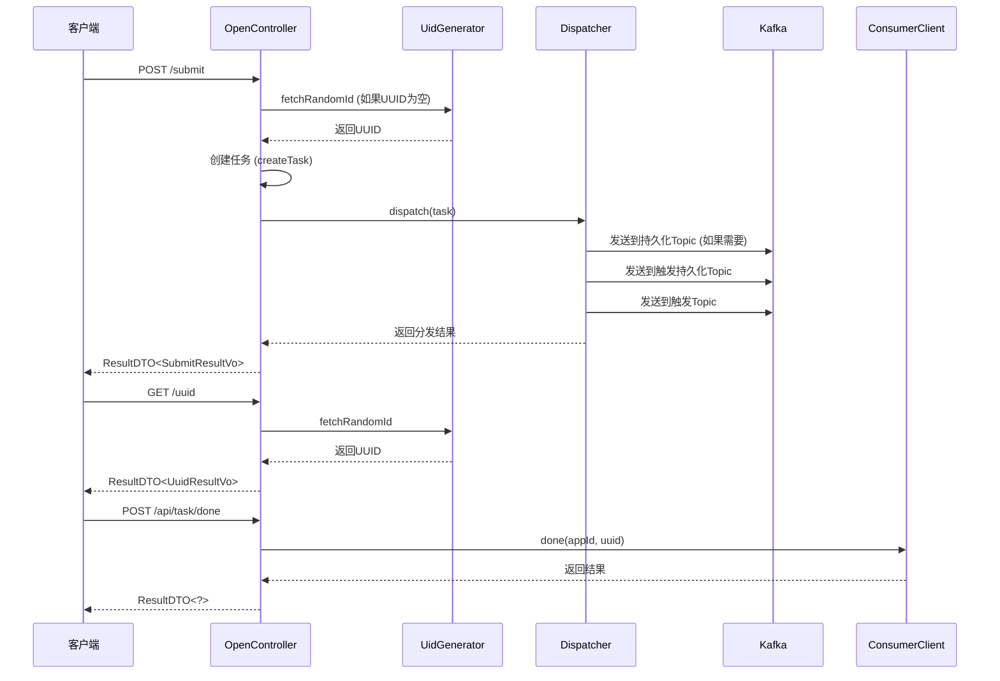
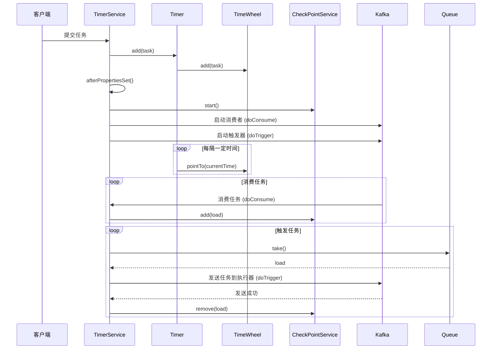
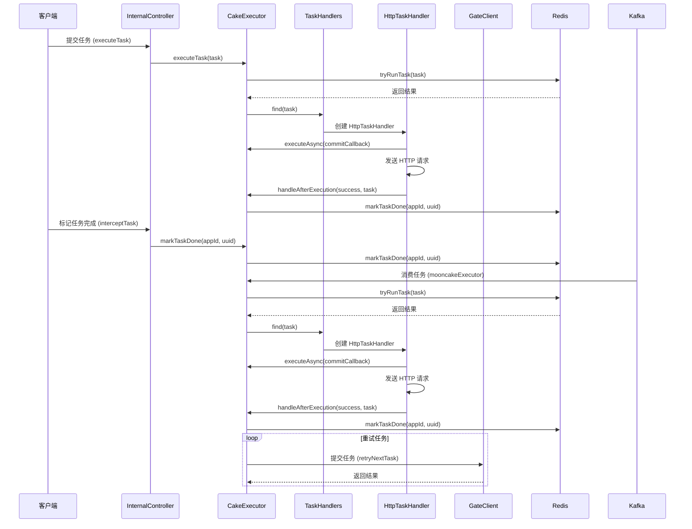
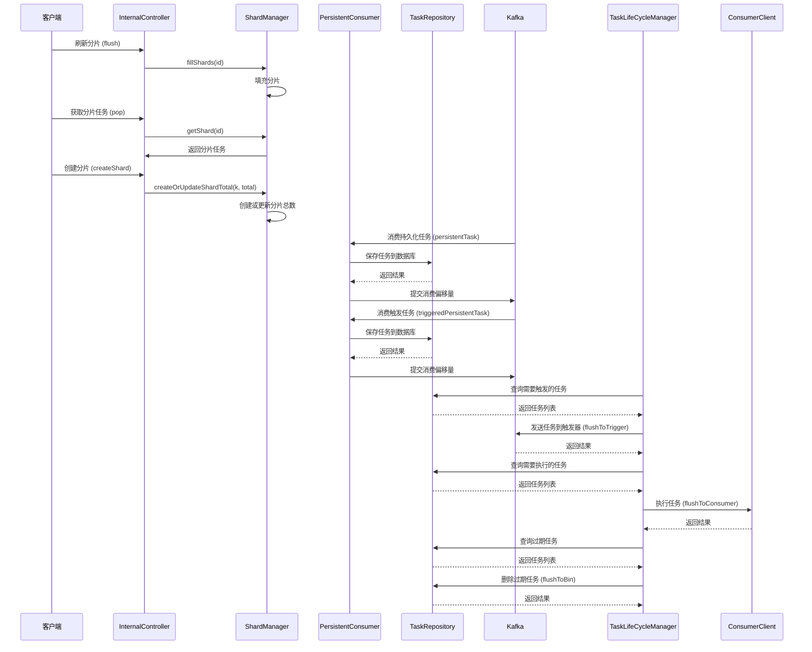
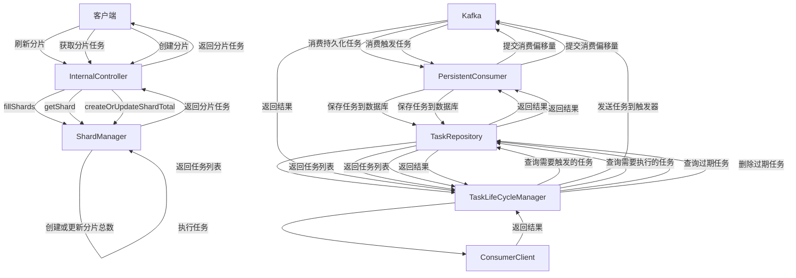

## mooncake-gate

### 主要功能

客户端提交任务，根据任务的过期时间，判断是否需要进行持久化，然后分发到不同的topic。

### 主要类

1. **OpenController 类**
   - `submit` 方法：接收外部任务请求，生成UUID（如果未提供），并调用 `submitInner` 方法提交任务。
   - `submitInner` 方法：将任务分发到相应的处理器（如Kafka），并返回提交结果。
   - `uuid` 方法：生成并返回一个新的UUID。
   - `markTaskDone` 方法：标记任务为完成状态。
2. **Dispatcher 接口**
   - 定义了 `dispatch` 方法，用于将任务发送到相应的处理器或持久化存储。
3. **DispatcherImpl 类**
   - 实现了 `Dispatcher` 接口，具体实现了任务分发逻辑。
   - `dispatch` 方法：根据任务的过期时间，将任务发送到不同的Kafka topic。
   - `send` 方法：将任务发送到指定的Kafka topic。
   - `needStore` 方法：判断任务是否需要持久化存储。

### 提供的接口

- `POST /submit`：提交延时任务。
- `POST /inner/submit`：内部提交任务接口。
- `GET /uuid`：生成UUID。
- `POST /api/task/done`：标记任务完成

### 时序图



### topic

```
trigger-topic: course_mooncake_trigger
trigger-persistent-topic: course_mooncake_persistent
triggered-persistent-topic: course_mooncake_triggered_persistent
```

1. **persistentTask**：用于持久化任务的Topic。
2. **triggeredPersistentTask**：用于触发任务的Topic。

#### 发送到不同Topic的逻辑

1. **持久化任务**：
   - 当有新的任务需要持久化时，任务会被发送到`persistentTask` Topic。
   - 这些任务通常是需要在未来某个时间点执行的任务。
2. **触发任务**：
   - 当持久化任务的执行时间到达时，任务会被发送到`triggeredPersistentTask ` Topic。
   - 这些任务是已经到达执行时间，需要立即处理的任务。

#### 不同Topic的处理逻辑

1. **persistentTask** Topic的处理逻辑：

   - **消费任务**：`PersistentConsumer`会从`persistentTask` Topic中消费消息。
   - **保存到数据库**：消费到的任务会被保存到数据库中，记录任务的详细信息和状态。
   - **提交偏移量**：任务保存成功后，提交Kafka的消费偏移量，确保消息不会被重复消费。

2. **triggeredPersistentTask** Topic的处理逻辑：

   - **消费任务**：`PersistentConsumer`会从`triggeredPersistentTask` Topic中消费消息。

   - **保存到数据库**：消费到的任务会被保存到数据库中，更新任务的状态为“待执行”。

   - **提交偏移量**：任务保存成功后，提交Kafka的消费偏移量，确保消息不会被重复消费

     

## mooncake-producer

1. **Timer 类**
   - `Timer` 类负责管理时间轮的拨动和任务的添加。
   - `start` 方法：启动定时任务，每隔一定时间拨动时间轮。
   - `add` 方法：将任务添加到时间轮中。
2. **TimerService 类**
   - `TimerService` 类负责管理任务的触发和消费。
   - `afterPropertiesSet` 方法：初始化服务，启动检查点服务和触发器，并启动Kafka消费者。
   - `doTrigger` 方法：从队列中获取任务并发送到Kafka的执行器Topic。
   - `doConsume` 方法：从Kafka的触发Topic中消费任务，并将任务添加到检查点服务中。
   - `doConsumerInner` 方法：具体的消费逻辑，包括分区的分配和撤销处理。
   - `createLoad` 方法：从Kafka记录中创建任务负载对象。
3. **TimeWheel 类**
   - `TimeWheel` 类实现了时间轮的核心逻辑，包括任务的添加和时间的推进。
   - `add` 方法：将任务添加到时间轮中。
   - `pointTo` 方法：推进时间轮到指定时间点，并触发过期任务。
4. **Load 类**
   - `Load` 类表示一个任务负载，包含任务的相关信息。
   - `getExpireTime` 方法：获取任务的过期时间。
5. **Expired 接口**
   - `Expired` 接口定义了获取过期时间的方法。
6. **CheckPointService 类**
   - `CheckPointService` 类负责管理检查点，确保任务的正确处理和提交。
   - `start` 方法：启动检查点服务。
   - `register` 方法：注册检查点。
   - `deregister` 方法：注销检查点。
   - `add` 方法：添加任务到检查点。
   - `remove` 方法：从检查点移除任务。
   - `doConsume` 方法：处理检查点的添加和移除操作。
7. **CheckPoint 类**
   - `CheckPoint` 类表示一个检查点，管理任务的提交和标记。
   - `add` 方法：添加任务到检查点。
   - `tryMark` 方法：尝试标记任务为已处理。
   - `tryUpdateCommitOffset` 方法：更新提交偏移量。
8. **Bucket 类**
   - `Bucket` 类表示一个任务桶，管理任务的计数和最大偏移量。
   - `merge` 方法：合并任务到桶中。
   - `decrement` 方法：减少桶中的任务计数。

### 提供的接口

- `TimerService` 类提供了任务触发和消费的核心逻辑，通过Kafka进行任务的分发和消费。
- `CheckPointService` 类提供了检查点的管理接口，确保任务的正确处理和提交。



### 系统时序图解释

该系统时序图展示了延时任务调度系统的主要流程，包括任务的提交、时间轮的拨动、任务的消费和触发。以下是主要流程的详细描述：

1. **任务提交**
   - 客户端向 `TimerService` 提交任务。
   - `TimerService` 调用 `Timer` 的 `add` 方法，将任务添加到时间轮中。
   - `Timer` 调用 `TimeWheel` 的 `add` 方法，将任务添加到具体的时间槽中。
2. **系统初始化**
   - `TimerService` 调用 `afterPropertiesSet` 方法，初始化服务。
   - `TimerService` 启动 `CheckPointService`，调用其 `start` 方法。
   - `TimerService` 启动 Kafka 消费者，调用 `doConsume` 方法。
   - `TimerService` 启动触发器，调用 `doTrigger` 方法。
3. **时间轮拨动**
   - `Timer` 每隔一定时间调用 `TimeWheel` 的 `pointTo` 方法，推进时间轮到当前时间点。
   - `TimeWheel` 检查并触发过期任务。
4. **任务消费**
   - Kafka 消费者从 Kafka 的触发 Topic 中消费任务，调用 `TimerService` 的 `doConsume` 方法。
   - `TimerService` 调用 `CheckPointService` 的 `add` 方法，将任务添加到检查点服务中。
5. **任务触发**
   - `TimerService` 从队列中获取任务，调用 `doTrigger` 方法。
   - `TimerService` 将任务发送到 Kafka 的执行器 Topic。
   - Kafka 确认任务发送成功。
   - `TimerService` 调用 `CheckPointService` 的 `remove` 方法，从检查点服务中移除任务。

### 主要流程总结

- **任务提交**：客户端提交任务，任务被添加到时间轮中。
- **系统初始化**：初始化服务，启动检查点服务、Kafka 消费者和触发器。
- **时间轮拨动**：定时拨动时间轮，检查并触发过期任务。
- **任务消费**：Kafka 消费者消费任务，将任务添加到检查点服务中。
- **任务触发**：从队列中获取任务，发送到执行器，确认发送成功后从检查点服务中移除任务。

1. **Timer 类**
   - `Timer` 类负责管理时间轮的拨动和任务的添加。
   - `start` 方法：启动定时任务，每隔一定时间拨动时间轮。
   - `add` 方法：将任务添加到时间轮中。
2. **TimerService 类**
   - `TimerService` 类负责管理任务的触发和消费。
   - `afterPropertiesSet` 方法：初始化服务，启动检查点服务和触发器，并启动Kafka消费者。
   - `doTrigger` 方法：从队列中获取任务并发送到Kafka的执行器Topic。
   - `doConsume` 方法：从Kafka的触发Topic中消费任务，并将任务添加到检查点服务中。
   - `doConsumerInner` 方法：具体的消费逻辑，包括分区的分配和撤销处理。
   - `createLoad` 方法：从Kafka记录中创建任务负载对象。
3. **TimeWheel 类**
   - `TimeWheel` 类实现了时间轮的核心逻辑，包括任务的添加和时间的推进。
   - `add` 方法：将任务添加到时间轮中。
   - `pointTo` 方法：推进时间轮到指定时间点，并触发过期任务。
4. **Load 类**
   - `Load` 类表示一个任务负载，包含任务的相关信息。
   - `getExpireTime` 方法：获取任务的过期时间。
5. **Expired 接口**
   - `Expired` 接口定义了获取过期时间的方法。
6. **CheckPointService 类**
   - `CheckPointService` 类负责管理检查点，确保任务的正确处理和提交。
   - `start` 方法：启动检查点服务。
   - `register` 方法：注册检查点。
   - `deregister` 方法：注销检查点。
   - `add` 方法：添加任务到检查点。
   - `remove` 方法：从检查点移除任务。
   - `doConsume` 方法：处理检查点的添加和移除操作。
7. **CheckPoint 类**
   - `CheckPoint` 类表示一个检查点，管理任务的提交和标记。
   - `add` 方法：添加任务到检查点。
   - `tryMark` 方法：尝试标记任务为已处理。
   - `tryUpdateCommitOffset` 方法：更新提交偏移量。
8. **Bucket 类**
   - `Bucket` 类表示一个任务桶，管理任务的计数和最大偏移量。
   - `merge` 方法：合并任务到桶中。
   - `decrement` 方法：减少桶中的任务计数。

## mooncake-consumer

主要实现了延时任务的消费、执行和管理。它包括了任务的HTTP请求处理、任务状态管理、任务重试机制、Redis缓存管理、以及与其他服务的通信等功能。

#### 代码分析

1. **TomcatAccessLogCustomizer 类**
   - 该类实现了 `WebServerFactoryCustomizer<TomcatServletWebServerFactory>` 接口，用于自定义 Tomcat 的访问日志配置。
   - `customize` 方法：获取 Tomcat 的 `AccessLogValve` 并设置日志保留天数为1天。
2. **Stage 枚举**
   - 该枚举定义了任务的不同阶段，包括 `TODO`、`INIT` 和 `DONE`。
   - 提供了获取阶段值的方法 `getValue` 和根据值获取阶段的方法 `of`。
3. **Props 类**
   - 该类用于读取配置文件中的 Redis 配置信息。
   - 包含一个内部静态类 `Redis`，用于存储 Redis 地址列表。
4. **InternalController 类**
   - 该类是一个 Spring MVC 控制器，提供了两个接口用于执行任务和标记任务完成。
   - `executeTask` 方法：接收任务并调用 `CakeExecutor` 执行任务。
   - `interceptTask` 方法：接收任务标识并调用 `CakeExecutor` 标记任务完成。
5. **GateClient 接口**
   - 该接口使用 FeignClient 与 `mooncake-gate` 服务通信，提供了提交任务和获取 UUID 的接口。
   - 包含一个内部静态类 `Fallback`，用于处理服务调用失败的情况。
6. **CoreConfig 类**
   - 该类是一个 Spring 配置类，提供了 OkHttpClient 和 JedisCluster 的 Bean 配置。
   - `okHttpClient` 方法：配置 OkHttpClient。
   - `getJedisCluster` 方法：配置 JedisCluster。
7. **TaskHandlers 类**
   - 该类用于查找并创建任务处理器。
   - `find` 方法：根据任务创建 `HttpTaskHandler`。
8. **TaskHandler 接口**
   - 该接口定义了任务处理器的基本方法，包括异步执行和同步执行。
9. **HttpTaskHandler 类**
   - 该类实现了 `TaskHandler` 接口，负责处理 HTTP 任务。
   - `executeAsync` 方法：异步执行任务。
   - `execute` 方法：同步执行任务。
   - `httpRequest` 方法：创建 HTTP 请求。
   - `handleHttpTaskResponse` 方法：处理 HTTP 响应。
10. **CakeExecutor 类**
    - 该类实现了 `TaskManager` 接口，负责任务的执行和管理。
    - `mooncakeExecutor` 方法：Kafka 消费者，接收并处理任务。
    - `tryRunTask` 方法：尝试执行任务。
    - `handleAfterExecution` 方法：处理任务执行后的逻辑。
    - `executeTask` 方法：执行任务。
    - `markTaskDone` 方法：标记任务完成。
11. **OkHttpService 类**
    - 该类提供了 OkHttpClient 的管理和配置。
    - `client` 方法：根据超时时间获取 OkHttpClient。

### 提供的接口

- InternalController

   

  提供了两个接口：

  - `/execute`：执行任务。
  - `/done`：标记任务完成。

- GateClient

   

  提供了两个接口：

  - `/inner/submit`：提交任务。
  - `/uuid`：获取 UUID。

### 系统时序图



### 主要流程总结

- **任务提交**：客户端提交任务，任务被添加到时间轮中。
- **系统初始化**：初始化服务，启动检查点服务、Kafka 消费者和触发器。
- **时间轮拨动**：定时拨动时间轮，检查并触发过期任务。
- **任务消费**：Kafka 消费者消费任务，将任务添加到检查点服务中。
- **任务触发**：从队列中获取任务，发送到执行器，确认发送成功后从检查点服务中移除任务。
- **任务执行**：通过 HTTP 请求执行任务，处理任务执行后的逻辑，包括重试机制和任务状态管理。


## mooncake-watcher

主要实现了延时任务的持久化、分片管理、任务生命周期管理以及与其他服务的通信。它包括了任务的持久化、任务的分片管理、任务的触发和执行、任务的状态管理、以及与其他服务的通信等功能。

#### 代码分析

1. **InternalController 类**
   - 该类是一个 Spring MVC 控制器，提供了三个接口用于分片管理。
   - `flush` 方法：刷新所有分片。
   - `pop` 方法：获取指定分片的任务。
   - `createShard` 方法：创建或更新分片总数。
2. **PersistentConsumer 类**
   - 该类实现了 `InitializingBean` 接口，用于消费 Kafka 中的持久化任务并将其保存到数据库中。
   - `afterPropertiesSet` 方法：启动持久化任务和触发任务的消费线程。
   - `persistentTask` 方法：消费持久化任务并保存到数据库中。
   - `triggeredPersistentTask` 方法：消费触发任务并保存到数据库中。
3. **ShardManager 接口**
   - 该接口定义了分片管理的基本方法，包括获取分片配置、获取分片、填充分片和创建或更新分片总数。
4. **ShardManagerImpl 类**
   - 该类实现了 `ShardManager` 接口，负责分片的管理。
   - `afterPropertiesSet` 方法：初始化分片配置。
   - `getShard` 方法：获取指定分片的任务。
   - `fillShards` 方法：填充分片。
   - `createOrUpdateShardTotal` 方法：创建或更新分片总数。
5. **TaskLifeCycleManager 接口**
   - 该接口定义了任务生命周期管理的基本方法，包括刷新任务到触发器、刷新任务到消费者和清除过期任务。
6. **TaskLifeCycleManagerImpl 类**
   - 该类实现了 `TaskLifeCycleManager` 接口，负责任务的生命周期管理。
   - `flushToTrigger` 方法：定期将持久化任务发送到触发器。
   - `flushToConsumer` 方法：定期将持久化任务发送到消费者。
   - `flushToBin` 方法：定期清除过期任务。
7. **TaskRepository 接口**
   - 该接口继承了 `JpaRepository`，用于操作数据库中的任务实体。
   - 提供了根据状态和过期时间查询任务的方法。
8. **TaskRepositoryHelper 类**
   - 该类提供了批量更新任务状态的方法。
9. **Shard 类**
   - 该类表示一个分片，包含分片总数和当前分片。
   - 提供了分片的有效性检查和分片命中判断的方法。
10. **ShardConfigValue 类**
    - 该类表示分片配置的值，包含分片总数和分片键。
11. **TaskEntity 类**
    - 该类表示任务实体，包含任务的基本信息和状态。
    - 提供了初始化任务和触发任务的方法。
12. **TaskId 类**
    - 该类表示任务的唯一标识，包含应用ID和任务ID。
13. **ConsumerClient 接口**
    - 该接口使用 FeignClient 与 `mooncake-consumer` 服务通信，提供了执行任务的接口。
    - 包含一个内部静态类 `Fallback`，用于处理服务调用失败的情况。

### 提供的接口

- InternalController

   

  提供了三个接口：

  - `/shard/fill`：刷新所有分片。
  - `/shard/pop`：获取指定分片的任务。
  - `/shard/create`：创建或更新分片总数。

- ConsumerClient

   

  提供了一个接口：

  - `/execute`：执行任务。

### 系统时序图



### 主要流程总结

- **分片管理**：通过 `ShardManager` 实现分片的创建、更新和填充。
- **任务持久化**：通过 `PersistentConsumer` 消费 Kafka 中的持久化任务并保存到数据库中。
- **任务生命周期管理**：通过 `TaskLifeCycleManager` 定期刷新任务到触发器和消费者，并清除过期任务。
- **任务执行**：通过 `ConsumerClient` 与 `mooncake-consumer` 服务通信，执行任务。


## Mooncake 模块分析及主要流程

#### 主要模块

1. **InternalController**：提供分片管理的接口。
2. **PersistentConsumer**：消费 Kafka 中的持久化任务并保存到数据库。
3. **ShardManager**：管理分片，包括获取、填充和创建/更新分片。
4. **TaskLifeCycleManager**：管理任务的生命周期，包括刷新任务到触发器、消费者和清除过期任务。
5. **TaskRepository**：操作数据库中的任务实体。
6. **ConsumerClient**：与 `mooncake-consumer` 服务通信，执行任务。

#### 主要流程

1. **分片管理**：
   - 创建或更新分片总数。
   - 获取指定分片的任务。
   - 刷新所有分片。
2. **任务持久化**：
   - 消费 Kafka 中的持久化任务并保存到数据库。
   - 消费 Kafka 中的触发任务并保存到数据库。
3. **任务生命周期管理**：
   - 定期将持久化任务发送到触发器。
   - 定期将持久化任务发送到消费者。
   - 定期清除过期任务。
4. **任务执行**：
   - 通过 `ConsumerClient` 与 `mooncake-consumer` 服务通信，执行任务。

### 流程图



### 时序图


### 主要实现细节

1. **InternalController**：
   - 提供刷新分片、获取分片任务和创建分片的接口。
   - 调用 `ShardManager` 的相应方法进行分片管理。
2. **PersistentConsumer**：
   - 实现 `InitializingBean` 接口，启动持久化任务和触发任务的消费线程。
   - 消费 Kafka 中的持久化任务和触发任务，并保存到数据库中。
3. **ShardManager**：
   - 管理分片的创建、更新和填充。
   - 提供获取指定分片任务的方法。
4. **TaskLifeCycleManager**：
   - 定期刷新任务到触发器和消费者。
   - 定期清除过期任务。
5. **TaskRepository**：
   - 提供操作数据库中任务实体的方法。
   - 提供根据状态和过期时间查询任务的方法。
6. **ConsumerClient**：
   - 使用 FeignClient 与 `mooncake-consumer` 服务通信，执行任务。

通过上述模块的协作，系统实现了延时任务的持久化、分片管理、任务生命周期管理和任务执行，确保任务在指定时间点被正确触发和执行，并提供了任务状态管理和分片管理机制。


 你好，今晚19点04分25秒的时候，有一笔支付请求响应超时了，能帮忙看下是什么原因吗。out_trade_no是：317310638640000046083

部分请求参数如下： 

<appid>wx6830882b577925e5</appid>  <mch_id>1641714449</mch_id>  <device_info>WEB</device_info><out_trade_no>317310638640000046083</out_trade_no>  <time_start>20241108190424</time_start>
