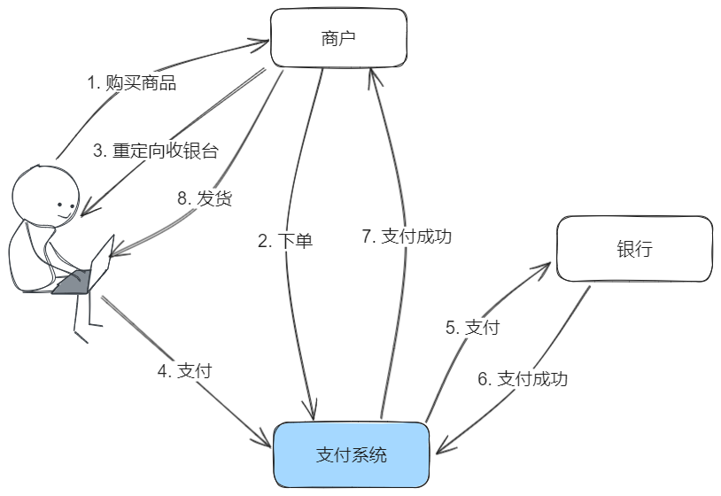
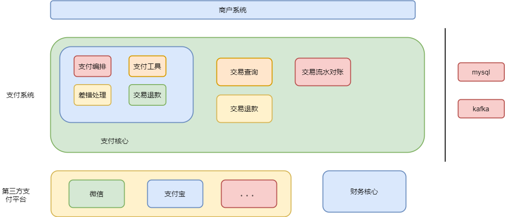
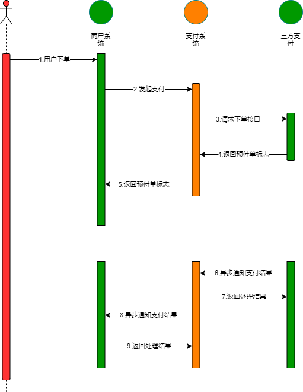
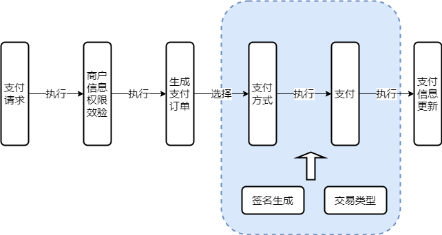
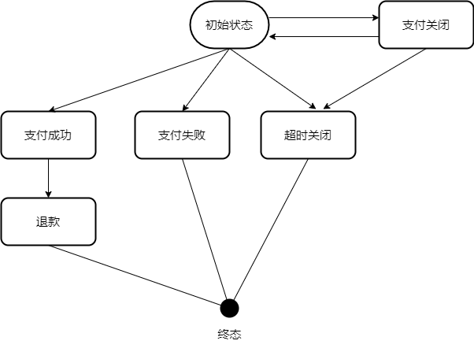
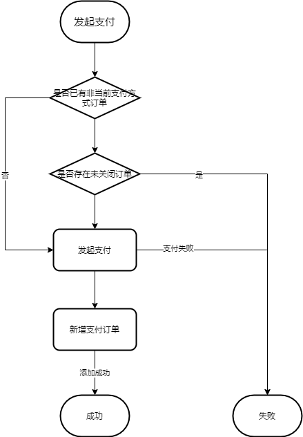
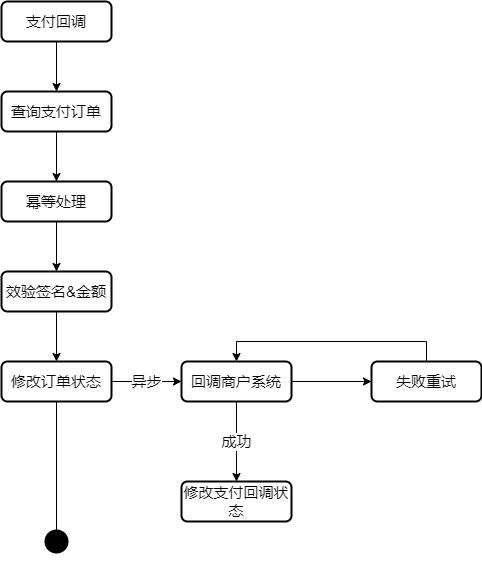
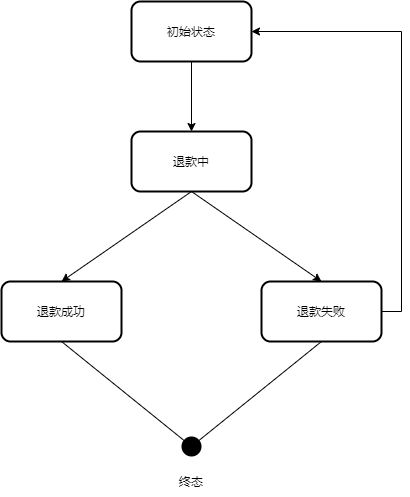
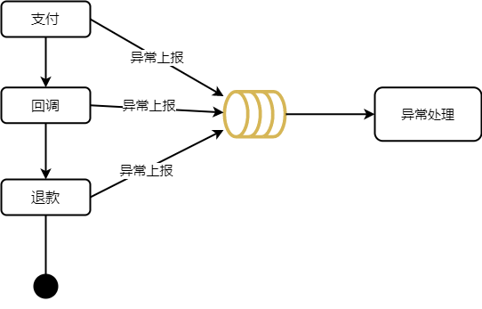

# 详解支付系统




## 实践案例

### 一. 系统设计

#### 1.系统架构

支付系统是一个支付聚合服务，旨在最大程度减少其他服务对接第三方支付的开发量，并将支付相关功能、信息统一化管理。



#### 2.流程设计

支付系统中最最核心的接口就是支付接口，整体支付流程的时序图可如下所示：




### 二. 详细设计

#### 1 支付设计

在整个支付流程里可分为两部分，调用第三方支付和支付回调。

商户系统在支付时通过统一接口进行支付，整体对第三方支付平台无感知，由支付系统做统一处理

在进行对接之前商户需要在支付系统填写商户信息以便后续支付，整体执行顺序大概如下



##### 1.1 重复支付问题&关闭订单

支付订单状态**除支付关闭外**只能正向进行，不能逆向修改，关闭的订单如未超时可再次打开进行支付。



##### 2. 重复支付

一个商户订单再**同一支付方式**下**在未支付成功前**可多次请求，但如果切换支付方式需要将之前其他方式支付的订单关闭。



如果订单支付失败，仍需支付的话，需要更改订单号

##### 3. 关闭订单

订单关闭只能关闭状态为支付中的订单，关闭订单之后如未超时可重新进行支付

#### 2 支付回调设计

第三方支付平台支付成功后，会回调支付系统，由支付系统进行统一处理后再回调商户系统。



支付系统在收到支付回调后异步回调商户系统，将三方支付与商户系统完全解耦，并在回调失败的24小时内不断重试，直至回调成功

商户在接收到支付系统发送的回调后只需要处理自身后续逻辑即可，无需考虑安全效验等问题。

**支付核心状态通过CAS方式修改**，防止并发，解决数据一致性问题

##### 2.1 方案对比

对于回调商户通知结果现有两种方式，通过接口回调或通过kafka发送消息，选择哪种或两者皆有需讨论后决定。

| 方案      | 优点                           | 缺点                                  | 是否采用 |
| --------- | ------------------------------ | ------------------------------------- | -------- |
| 接口回调  | 接入简单，不受内部服务限制     | 性能较低，存在丢失消息风险            | 是       |
| kafka消息 | 性能较高，保证消息一定能被消费 | 需调用方共同维护kafka，且只能内部使用 | 否       |

#### 3 退款流程

接入退款流程必须接入支付流程，退款功能依赖于支付功能。

支付系统支持全额退款和部分退款，但无论何种退款，一个订单的退款金额总和不能超过支付金额。

##### 3.1 支付状态

一个退款请求后，除退款失败外，不能重复提交请求。**一笔退款失败后重新提交，请不要更换退款单号，请使用原商户退款单号。**



在退款成功之后会将支付订单状态该为退款，注意，即使是部分退款也会更改状态。

#### 4 异常处理

异常分为两种，内部异常和外部异常，支付系统只能对内部异常进行处理，对于外部异常，如第三方支付返回结果异常，只能有商户系统进行处理。而对于支付系统内部异常，如非阻塞主流程的异常则放入异常队列，等待后续处理，如影响主流程异常，则抛出由商户处理。主流程如上图



非阻塞主流程的异常：

用户支付成功后，数据库异常导致修改支付订单状态失败，此等异常不应影响支付流程的进行，等待后续处理即可。

回调后服务器异常

退款成功后，修改数据库异常

#### 5 数据库设计

##### 商户表（pay_merchant）

| 字段名               | 描述                             |
| -------------------- | -------------------------------- |
| merchant_no          | 支付系统商户号                   |
| platform             | 支付平台（微信支付宝华为等）     |
| platform_merchant_no | 支付平台商户号                   |
| app_id               | 支付平台appId                    |
| key_type             | 密钥类型                         |
| private_key          | 私钥                             |
| public_key           | 公钥，只有一个密钥时私钥公钥一致 |
| del                  | 是否已删除，0未删除，1已删除     |
| create_time          | 创建时间                         |
| update_time          | 修改时间                         |

##### 支付流水表（pay_order）

| 字段名            | 描述                                                        |
| ----------------- | ----------------------------------------------------------- |
| id                | 支付系统流水号                                              |
| merchant_no       | 支付系统商户号                                              |
| out_trade_no      | 商户订单号                                                  |
| pay_type          | 支付类型（微信 wxPay、支付宝 aliPay）                       |
| trade_type        | 交易类型（如微信支付的APP、jsapi支付等）                    |
| trade_amount      | 订单金额                                                    |
| true_amount       | 实付金额                                                    |
| pay_user_id       | 支付用户标识                                                |
| notify_url        | 回调商户地址                                                |
| platform_trade_no | 支付平台交易流水号                                          |
| pay_finish_time   | 订单完成时间                                                |
| status            | 订单状态（0支付中，1支付成功，2支付关闭，3支付失败，4退款） |
| notify            | 支付回调状态（0未回调，1回调成功，2回调失败）               |

##### 退款记录表（refund_record）

| 字段名             | 描述                                             |
| ------------------ | ------------------------------------------------ |
| id                 | 退款id                                           |
| pay_order_id       | 支付订单id                                       |
| out_refund_no      | 商户退款号                                       |
| refund_amount      | 退款金额                                         |
| true_refund_amount | 实际退款金额                                     |
| refund_reason      | 退款原因                                         |
| notify_url         | 回调地址                                         |
| refund_finish_time | 退款完成时间                                     |
| platform_refund_no | 支付平台平台退款号                               |
| status             | 退款状态（0初始化 1 退款中 2退款成功 3退款失败） |
| notify             | 退款回调状态（0 未回调 1回调成功 2回调失败）     |

#### 6 熔断降级限流配置

对于服务的熔断降级的主流断路器有两种**Sentinel**和**Hystrix**

| 对比项         | Sentinel                                                   | Hystrix                 |
| :------------- | :--------------------------------------------------------- | :---------------------- |
| 隔离策略       | 信号量隔离（并发线程数限流）                               | 线程池隔离/信号量隔离   |
| 熔断降级策略   | 基于响应时间、异常比率、异常数                             | 基于异常比率            |
| 实时统计实现   | 滑动窗口（LeapArray）                                      | 滑动窗口（基于 RxJava） |
| 动态规则配置   | 支持多种数据源                                             | 支持多种数据源          |
| 扩展性         | 多个扩展点                                                 | 插件的形式              |
| 基于注解的支持 | 支持                                                       | 支持                    |
| 限流           | 基于 QPS，支持基于调用关系的限流                           | 有限的支持              |
| 流量整形       | 支持预热模式、匀速器模式、预热排队模式                     | 不支持                  |
| 系统自适应保护 | 支持                                                       | 不支持                  |
| 控制台         | 提供开箱即用的控制台，可配置规则、查看秒级监控、机器发现等 | 简单的监控查看          |

##### 6.1 限流

微信支付统一下单接口的QPS为600，支付宝暂无限制（单笔转账到账户限制每秒 10 笔转账）

对于支付接口采用**热点参数限流**（Sentinel），针对商户号进行限制

##### 6.2 降级

在流量激增时只保留支付接口可用，对于其余接口流量暂不处理。

### 三. 其余问题

#### 1 商户号与多appId

商户会有这样的需求，单个商户号希望能有多个appid进行支付（**支付系统只支持单商户号对应多appId，不支持多对多关系**）

##### 微信

普通商户需要向微信申请 **appid** 以及 **mchid**。

同一个 **mchid** 可以绑定多个 **appid**，两者可以是同一个公司主体，也可以不同公司主体（**限定资格开放**）。**mchid** 最多可以绑定 50 个 **appid**；

同一个 **appid** 又可以被多个 **mch** id 绑定，所以 **appid** 与 **mchid** 原则上是多对多的关系。

这里需要注意，微信清算资金实际上是基于 **mchid**。即同一个 mchid，使用多个 **appid** 做交易，第二天资金是清算到 **mchid** 绑定的商户的账户。

##### 支付宝

普通商户需要向支付宝申请入驻，将会得到商务号。接着需要创建应用得到 **appid**，上架成功后，需要进行签约。签约成功之后，这个 **appid** 与商户号建立唯一的绑定的关系。

同一个商户号可以绑定多个 **appid**，但是同一个 **appid** 只能绑定唯一个商户号。

支付宝的接口也可以看出，支付宝只要求传入 **appid**，后台肯定是跟库 **appid** 查找对应的商户号。所以简单而言 **appid** 与商户号是多对一的关系

#### 2 调用方案

调用方案暂时有两种api调用和提供SDK给调用方。

#### 3. SDK存在问题

1.配置问题

2.版本更迭问题


### 四. 接口文档

#### **角色介绍**

支付系统：当前接口文档系统

商户：对接当前接口文档方

支付平台：真正支付的平台，如微信、支付宝

注意：**一个业务方在支付中台只能有一个商户号，不管接几种支付方式**

#### 支付接口

支付接口未成功支付前可多次提交，但多次提交参数（如金额，交易类型）必须保持一致，如需更改需关闭订单（此方式订单金额不能改变），或更换订单号重新支付。

如需更换支付类型，需将前一个支付类型的支付订单进行关闭。

注意：同一订单号的同一支付方式的不同交易类型，过期时间、回调地址都以第一次请求为准。

**小程序支付请使用小程序支付类型，且只支持JSAPI交易类型**

**请求路径**：/pay/{支付类型枚举}

**请求方式**：POST

#### 请求参数

| 字段             | 类型       | 是否必填 | 描述                                                         | 示例值                                                       |
| ---------------- | ---------- | -------- | ------------------------------------------------------------ | ------------------------------------------------------------ |
| merchantNo       | String     | 是       | 支付系统商户号                                               | 1900000109                                                   |
| outTradeNo       | String     | 是       | 商户订单号                                                   | 1001252                                                      |
| totalAmount      | BigDecimal | 是       | 交易金额                                                     | 100.00                                                       |
| goodsName        | String     | 是       | 商品名称                                                     | 精品课                                                       |
| tradeType        | String     | 是       | 交易类型，每种支付方式交易类型不同，具体看下面枚举类型       | APP                                                          |
| notifyUrl        | String     | 是       | 回调通知地址                                                 | https://coursepay-test.youdao.com/notify/wx/pay              |
| returnUrl        | String     | 否       | wap支付完成后展示页面                                        | http://ke.youdao.com                                         |
| timeout          | Long       | 否       | 订单超时时间，时间戳格式，默认两小时，单位毫秒               | 3600000                                                      |
| autoCloseOrder   | Boolean    | 否       | 是否自动关闭订单，如果开启，则会自动关闭之前未关闭的订单，默认false | true                                                         |
| wxSdkVersion     | String     | 否       | 客户端微信SDK版本，默认为旧版SDK，安卓格式为6.8.0，iOS格式为iOS.1.8.7 | 6.8.0                                                        |
| pressureTestFlow | boolean    | 否       | 是否是压测流量，与goodsName参数配合使用，该参数为true且goodsName以QA、qa或QA开头时，用户无需支付即可自动进行支付成功回调，实现线上真实支付流程链路，默认false | true                                                         |
| userClientIp     | String     | 否       | 用户客户端IP，当微信支付且tradeType为MWEB必填，NATIVE选填    | 123.12.12.123                                                |
| openid           | String     | 否       | 微信支付 trade_type=JSAPI时（即JSAPI支付），此参数必传，此参数为微信用户在商户对应appid下的唯一标识。 | oUpF8uMuAJO_M2pxb1Q9zNjWeS6o                                 |
| sceneInfo        | String     | 否       | 微信支付trade_type=MWEB时必传 上报支付的场景信息             | 1，IOS移动应用 {"h5_info": //h5支付固定传"h5_info"   {"type": "", //场景类型    "app_name": "", //应用名    "bundle_id": "" //bundle_id    } } 2，安卓移动应用 {"h5_info": //h5支付固定传"h5_info"   {"type": "", //场景类型    "app_name": "", //应用名    "package_name": "" //包名    } }3，WAP网站应用 {"h5_info": //h5支付固定传"h5_info"   {"type": "", //场景类型   "wap_url": "",//WAP网站URL地址   "wap_name": "" //WAP 网站名   } } |
| productId        | String     | 否       | trade_type=NATIVE时，此参数必传。此参数为二维码中包含的商品ID，商户自行定义。 | 12235413214070356458058                                      |

##### 公共返回参数

| 字段名 | 类型   | 是否必填 | 描述         | 示例值              |
| ------ | ------ | -------- | ------------ | ------------------- |
| code   | int    | 是       | 返回code值   | 0                   |
| msg    | String | 否       | 异常错误信息 | appid和openid不匹配 |
| data   | json   | 是       | 返回结果     |                     |

##### 返回结果参数

| 字段名     | 类型   | 是否必填 | 描述                                                         | 示例值                                                       |
| ---------- | ------ | -------- | ------------------------------------------------------------ | ------------------------------------------------------------ |
| merchantNo | String | 是       | 商户号                                                       | 1900000109                                                   |
| outTradeNo | String | 是       | 商户订单号                                                   | 1001252                                                      |
| payId      | String | 是       | 支付标记，存在以下情况 1.微信APP，jsapi支付时为预支付标识，NATIVE支付时为二维码链接，mweb支付时为支付链接 2.支付宝支付，app支付时为表单格式，可嵌入页面，wap、web支付时为支付链接 | https://wx.tenpay.com/cgi-bin/mmpayweb-bin/checkmweb?prepay_id=wx25160320632019b49e09d6dc3c0e4b0000&package=4156714583 |
| payTradeNo | String | 是       | 支付系统号                                                   | 1165458783000681                                             |
| extraParam | Map    | 否       | 支付额外参数，在微信支付中，APP支付和JSAPI由客户端吊起支付时需要 | { "package":"Sign=WXPay", "appid":"wx977e6b9c17b3b853", "sign":"5E283D66B02692BF5FDA48331A082DB6", "partnerid":"1900000109", "prepayid":"wx161211578478746bcaf987eb52560c0000", "noncestr":"5395784646497386", "timestamp":1647403918 } |

#### 参数详解

#### 支付方式枚举

编号为支付中心订单号前缀，用于区分不同支付方式的订单

| 支付方式   | 枚举值      | 编号          |
| ---------- | ----------- | ------------- |
| 微信支付   | wxPay       | 1（JSAPI为3） |
| 支付宝支付 | aliPay      | 4             |
| 微信小程序 | wxAppletPay | 2             |
| 苹果支付   | applePay    | 5             |

#### 交易类型枚举

| 支付方式   | 交易类型     | 枚举值 |
| ---------- | ------------ | ------ |
| 微信支付   | APP支付      | APP    |
|            | JSAPI支付    | JSAPI  |
|            | H5支付       | MWEB   |
|            | Native支付   | NATIVE |
| 支付宝支付 | APP支付      | APP    |
|            | 手机网页支付 | WAP    |
|            | 电脑网页支付 | WEB    |
| 小程序支付 | 小程序支付   | JSAPI  |

#### 微信支付payId举例

**JSAPI/APP**（微信生成的预支付回话标识，用于后续接口调用中使用，该值有效期为2小时）

```
wx201410272009395522657a690389285100
```

**MWEB** (为拉起微信支付收银台的中间页面，可通过访问该url来拉起微信客户端，完成支付,mweb_url的有效期为5分钟。)

正常流程用户支付完成后会返回至发起支付的页面，如需返回至指定页面，则可以在MWEB_URL后拼接上redirect_url参数，来指定回调页面，但需对redirect_url进行urlencode处理。

```http
https://wx.tenpay.com/cgi-bin/mmpayweb-bin/checkmweb?prepay_id=wx2016121516420242444321ca0631331346&package=1405458241
```

**NATIVE** (code_url的值并非固定，使用时按照URL格式转成二维码即可。时效性为2小时)

```http
weixin://wxpay/bizpayurl/up?pr=NwY5Mz9&groupid=00
```

#### 微信支付返回extraParam参数

APP支付

```json
{
    "appid": "wx977e6b9c17b3b853",                                  //应用ID
    "partnerid": "1900000109",                                      //商户号
    "noncestr": "5395784646497386",                                 //随机字符串
    "timestamp": 1647403918,                                        //时间戳
    "sign": "5E283D66B02692BF5FDA48331A082DB6",                     //签名
    "package": "Sign=WXPay",                                        //扩展字段,固定值Sign=WXPay
    "prepayid": "wx161211578478746bcaf987eb52560c0000",             //预支付交易会话ID
}
```

JSAPI支付

```json
{
    "appId": "wx977e6b9c17b3b853",                                  //应用ID
    "nonceStr": "5395784646497386",                                 //随机字符串
    "timeStamp": 1647403918,                                        //时间戳
    "paySign": "5E283D66B02692BF5FDA48331A082DB6",                  //签名
    "package": "prepay_id=wx161211578478746bcaf987eb52560c0000",    //扩展字段,统一下单接口返回的prepay_id参数值，提交格式如：prepay_id=***            
    "signType": "MD5",                                              //签名类型
}
```

#### 支付宝支付payId举例

APP

```
alipay_sdk=alipay-sdk-java-dynamicVersionNo&app_id=2021003120666438&biz_content=%7B%22out_trade_no%22%3A%221001315%22%2C%22total_amount%22%3A0.01%2C%22subject%22%3A%22%E6%94%AF%E4%BB%98%E5%AE%9D%E6%94%AF%E4%BB%98%E6%B5%8B%E8%AF%95%22%2C%22product_code%22%3A%22QUICK_MSECURITY_PAY%22%2C%22time_expire%22%3A%222022-03-25+19%3A52%3A27%22%7D&charset=utf-8&format=json&method=alipay.trade.app.pay&notify_url=https%3A%2F%2Fcoursepay-test.youdao.com%2Fnotify%2Fali%2Fpay&sign=dNNeh19jhfkh3PFP6FngLCc1KV0Ix2sulojwOZ43jRG66UKSTPtMP8cAd%2BFY4QPQ1GR0M%2BvWu%2FwlxwStw1nO5rEM5TGAsY1lhKJxrAkiXTjU5DtWQ%2F0fwUIFN4wf2fRvcJHi%2FKYzOIf49fbJtCc5N1g5vfvxpeA%2FkiY101vPqEu%2Bwlbv4CIYhmL%2BLdufDvbtdFhnJzYBlndzfKXVWM2ZSWyxOa5QzVQBYGyJRCF8oYtgMXquTxe%2FqTmUgWtBCcREY1OL4dUM25LouUCzLIFMPYJKLvvypk4B3fJc3etT3DIpvNvH36%2BLBPXa6GbTb04ytaqMKGg%2FaA%2BSiZPE2gtSQw%3D%3D&sign_type=RSA2&timestamp=2022-03-25+17%3A52%3A27&version=1.0
```

WAP&&WEB

```http
https://openapi.alipay.com/gateway.do??alipay_sdk=alipay-sdk-java-dynamicVersionNo&app_id=2021003105646770&biz_content=%7B%22out_trade_no%22%3A%221001242%22%2C%22total_amount%22%3A0.01%2C%22subject%22%3A%22%E6%94%AF%E4%BB%98%E5%AE%9D%E6%94%AF%E4%BB%98%E6%B5%8B%E8%AF%95%22%2C%22product_code%22%3A%22QUICK_WAP_PAY%22%2C%22time_expire%22%3A%222022-02-25+17%3A44%3A01%22%7D&charset=utf-8&format=json&method=alipay.trade.wap.pay&notify_url=https%3A%2F%2Fcoursepay-test.youdao.com%2Fnotify%2Fali%2Fpay&sign=YAXVkY1VITZFb3vfWXjwNhO6QQARuGnSDwtYkJAI6Owsu%2B9ghgsQ35w6dYIrN0FfICOChkoNDsOXT5utRd7zEYV4aNuQXwTVgjeSOukW8I4TJhgJIRbc8XjuPl21CBzznAJjLzSnLIC%2FUpYrH7oVE0V8Jyka5kXAWckYD2KmIqq6K1mE6bCQjVMoIVDiIOJt%2FGR6aqXnkAu17GPT5YU66voBa02YjCgu9%2Fibse%2BOSXORfkrNq50wXWjBu1rp0Bgaz4fPs%2BmeSVsnPOfu70uKq%2F5rfkN6ksPiVS9IReDIWuIqHEItZ66Z00ynbfO74sOxVCJ%2BFIlc86Ypx1NjxlHM1w%3D%3D&sign_type=RSA2&timestamp=2022-02-25+15%3A44%3A01&version=1.0
```

### 请求示例

```json
{
    "merchantNo": "1900000109",
    "outTradeNo": "1001252",
    "totalAmount": 0.01,
    "goodsName": "微信网页支付测试",
    "tradeType": "APP",
    "notifyUrl": "http://www.baidu.com",
    "timeout": "3600000",
    "autoCloseOrder": true,
    "wxSdkVersion": "6.8.0",
    "userClientIp": "123.12.12.123",
    "openid": "oUpF8uMuAJO_M2pxb1Q9zNjWeS6o",
    "sceneInfo": "{ \"h5_info\": { \"type\": \"Wap\", \"wap_url\": \"https://ke.youdao.com/wap/\", \"wap_name\": \"有道精品课\" }"
}
```

### 响应示例

```json
{
    "code": 0,
    "msg": null,
    "data": {
        "merchantNo": "1900000109",
        "outTradeNo": "1001252",
        "payId": "wx171650419491044e35a14870b466720000",
        "payTradeNo": "202202251604111038535831629",
        "extraParam": {
            "appid": "wx977e6b9c17b3b853",                              
            "partnerid": "1900000109",                                  
            "noncestr": "5395784646497386",                         
            "timestamp": 1647403918,                                        
            "sign": "5E283D66B02692BF5FDA48331A082DB6",                 
            "package": "Sign=WXPay",                                    
            "prepayid": "wx161211578478746bcaf987eb52560c0000", 
        }
    }
}
```

### 异常码

| 异常码 | 异常信息         | 举例                               |
| ------ | ---------------- | ---------------------------------- |
| 1      | 服务器错误       | 服务器错误                         |
| 10002  | 参数错误         | 商户号不能为空                     |
| 10003  | 外部服务异常     | 微信支付接口异常                   |
| 10004  | 外部服务业务异常 | 基本账户余额不足，请充值后重新发起 |
| 20001  | 商户号不存在     | 该商户号未添加微信商户信息         |
| 20002  | 交易类型错误     | 交易类型不合法                     |
| 20003  | 重复提交请求     | 订单已成功支付                     |
| 20004  | 支付订单异常     | 支付记录不存在                     |
| 20005  | 支付类型错误     | 支付类型不存在                     |
| 20006  | 支付验证错误     | 支付结果验证不通过                 |
| 21001  | 退款金额异常     | 可退款余额不足                     |
| 21002  | 退款请求错误     | 该退款已成功                       |
| 21003  | 退款单不存在     | 退款单不存在                       |

## 苹果支付

苹果支付比较特殊，支付流程在客户端进行，服务端只进行结果的验证，并将支付流水记录

**请求路径**：/pay/applePay

**请求方式**：POST

**请求参数**：

```json
{
    "merchantNo": "1900000109",					//商户号
    "outTradeNo": "1001252",					//订单号
    "totalAmount": 0.01,						//交易金额
    "transactionId": "xxxxxxxxxxxx",			//苹果交易id
    "receipt": "xxxxxxxxxxxxx"					//苹果支付数据
}
```

**返回参数**

```json
{
    "code": 0,
    "msg": null,
    "data": {
        "merchantNo": "1900000109",
        "outTradeNo": "1001252",
        "payTradeNo": "202202251604111038535831629"
    }
}
```

## 支付回调

该接口为支付成功后支付系统回调商户系统，商户系统获取到支付回调之后，如无问题，resultCode必须返回SUCESS，如不返回则支付系统认为回调失败，会发起重试。重试时间为：[5m,10m,30m,1h,2h,6h,12h]

**请求方式**：POST

**请求参数**：

```json
{
    "code": "SUCCESS",   		  //支付结果，SUCCESS为成功，FAIL为失败
    "merchantNo": "1900000109",	  //商户号
    "outTradeNo": "1001252",		//商户订单号
    "payType": "wxPay",			//支付方式
    "payUserId": "wxd930ea5d5a258f4f",		  //支付用户在该支付平台标识
    "platformTradeNo": "1217752501201407033233368018",  //支付平台订单号
    "tradeAmount": 0.01, 					//交易金额
    "trueAmount": 0.01,  	//实际付款金额
    "payTradeNo": "202202251604111038535831629"  //支付系统订单号
}
```

**返回参数**

```json
{
    "resultCode": "SUCCESS",   //必填，回调返回结果，SUCCESS为成功，FAIL为失败
    "msg": "",	  //错误信息
}
```

## 退款接口

**一笔退款失败后重新提交，请不要更换退款单号，请使用原商户退款单号。**

**请求路径**：/pay/refund

**请求方式**：POST

**请求参数**

```json
{
    "merchantNo": "1900000109",   //必填，商户号
    "outTradeNo": "1001252",	  //必填，支付订单号
    "outRefundNo": "1001252_1",			//必填，商户退款单号,针对同一次退款请求，如果调用接口失败或异常了，重试时需要保证退款请求号不能变更，防止该笔交易重复退款。
    "refundAmount": 0.01,			//必填，退款金额
    "refundReason": "用户退款",		  //非必填，退款原因
    "notifyUrl": "http://www.baidu.com"  //退款结果回调地址
}
```

**返回参数**

```json
{
    "code": 0,
    "msg": null,							//错误信息
    "data": {
        "merchantNo": "1900000109",			//商户号
        "outTradeNo": "1001252",			//商户订单号
        "outRefundNo": "1001252_1",			//商户退款单号
        "refundId": 10025  					//支付系统退单号
    }
}
```

## 退款接口V2

**请求路径**：/pay/refund/v2

**请求方式**：POST

请求参数与返回值与退款接口一直，该接口按照支付时所使用的商户信息进行退款

## 退款回调

**请求方式**：POST

**请求参数**：

```json
{
    "code": "SUCCESS",   		  	//支付结果，SUCCESS为成功，FAIL为失败
    "merchantNo": "1900000109",	  	//商户号
    "outTradeNo": "1001252",		//商户订单号
    "outRefundNo": "1001252_1",		//商户退款单号
    "refundAmount": 0.01, 			//交易金额
    "refundId": 10025,  			//支付系统退款Id
    "errMsg": "系统异常"		 	 //退款异常信息
}
```

**返回参数**

```json
{
    "resultCode": "SUCCESS",   	//必填，回调返回结果，SUCCESS为成功，FAIL为失败
    "msg": "",	  				//错误信息
}
```

## 关闭订单

**请求路径**：/order/close

**请求方式**：POST

**请求参数**：

```json
{
    "merchantNo": "1900000109",	  	//商户号
    "outTradeNo": "1001252",		//商户订单号
    "payType": "wxPay",				//商户退款单号
}
```

**返回参数**

```json
{
    "code": 0,								//返回0代表成功，其他失败
    "msg": null,
    "data": "202203221500391175469297071" 	//支付系统订单号
}
```

## 支付订单查询

**请求路径**：/order/query

**请求方式**：POST

**请求参数**：

```json
{
    "merchantNo": "1900000109",	  	//商户号
    "outTradeNo": "1001252",		//商户订单号
    "payType": "wxPay",				//商户退款单号
}
```

**返回参数**

```json
{
    "code": 0,
    "msg": null,
    "data": {
        "payTradeNo": "202203221500391175469297071",		//支付系统订单号
        "merchantNo": "1900000109",							//商户号
        "outTradeNo": "1001302",							//商户订单号
        "payUserId": "wxd930ea5d5a258f4f",		  			//支付用户在该支付平台标识
    	"platformTradeNo": "1217752501201407033233368018",  //支付平台订单号
        "payType": "wxPay",									//支付方式
        "tradeAmount": 0.01,								//交易金额
        "trueAmount": 0.01,  								//实际付款金额
        "tradeType": "NATIVE",								//交易方式，详见上面枚举值
        "status": "TIME_OUT"								//订单状态，详见下面枚举值							
    }
}
```

#### 订单状态枚举

| 订单状态               | 枚举值   |
| ---------------------- | -------- |
| 支付中                 | INIT     |
| 支付成功               | SUCCESS  |
| 支付失败               | FAIL     |
| 支付关闭               | CLOSED   |
| 支付超时               | TIME_OUT |
| 已退款（包括部分退款） | REFUND   |

## 支付退款查询

**请求路径**：/order/refund/query

**请求方式**：POST

**请求参数**：

```json
{
    "merchantNo": "1900000109",	  	//商户号
    "outTradeNo": "1001276",		//商户订单号
    "outRefundNo": "1001276",		//商户退款单号
}
```

**返回参数**

```json
{
    "code": 0,
    "msg": null,
    "data": {
        "merchantNo": "1900000109",								//商户号
        "outTradeNo": "1001276",								//商户订单号
        "outRefundNo": "1001276",								//商户退款号
        "refundAmount": 0.01,									//退款金额
        "refundReason": "微信退款测试",							//退款原因
        "refundId": 10026,										//支付平台退款号
        "status": "SUCCESS"										//退款状态，详见下面枚举值							
    }
}
```

#### 订单状态枚举

| 订单状态 | 枚举值  |
| -------- | ------- |
| 退款中   | INIT    |
| 退款成功 | SUCCESS |
| 退款失败 | FAIL    |

## 新增商户信息

**请求路径**：/merchant/add

**请求方式**：POST

**请求参数**（form-data）：

```json
merchantNo="1900000109"			//商户号，非必填，如未填写由系统生成，同一业务线商户号只能有一个
platform="wxPay"				//支付平台
appId="wx977e6b9c17b3b853"	
platformMerchantNo="1462617702"	//平台商户号，微信必填，支付宝非必填
privateKey=""					//私钥
publicKey=""					//公钥
apiCert							//微信API证书，微信必填，文件格式						
```

**返回参数**

```json
{
    "code": 0,
    "msg": null,
    "data": "1900000109"		//商户号
}
```