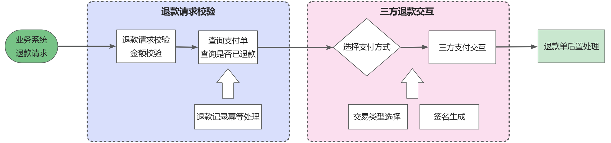

# 支付系统设计--服务端

# 一. 背景

​	随着业务的快速发展与变化，业务模式由原有的独立 APP 售卖模式调整为以业务为导向，各业务百花齐放，各自建设业务系统模式。原有售卖模式采用的支付方式与独立 APP 耦合，且支付方式仅支持一个AppId，对应一个微信或支付宝商户号，无法满足各业务搭建 App 及独立售卖的模式。需要提供业务统一的支付平台能力，支持业务与支付中心一次对接，即可打通支付整体流程。

支付中心在现代企业中扮演着至关重要的角色，它不仅是内部业务线之间的支付服务提供者，还是与外部三方支付机构或银行之间的资金流转的桥梁，有助于实现支付流程的标准化、高效化和安全化。

- 对内方面：支付中心为各业务线提供统一的支付和退款服务，方便各业务之间的数据交互和整合，有助于简化业务流程，减少重复开发和维护成本，同时提高支付和退款的处理效率；
- 对外方面：支付中心需要对接各种三方支付机构或银行服务，实现资金的流转，为企业提供更广泛、更灵活的支付结算服务，满足企业不断增长的业务需求。

支付中心系统的设计旨在实现对内统一支付和退款服务，对外对接三方支付服务，实现资金流转。

## 1. 业务架构

支付中心是一个支付聚合服务，旨在最大程度减少其他服务对接第三方支付的开发量，并将支付相关功能、信息统一化管理。


## 2. 极简支付流程

从服务端设计的角度看，一个极简的订单支付的流程如下：


1. 创建订单：用户从客户端下单，创建订单的流程，生成订单记录（通常包括订单号、用户信息、商品详情、总价、支付状态等）；
2. 生成支付信息：商家服务端会根据订单信息生成支付信息，包括支付金额、支付方式、订单号等，用于后续的支付流程；
3. 返回支付页面：服务端将支付信息返回给客户端，客户端根据支付信息生成支付页面(包含支付金额、支付方式、订单号等信息)，并引导用户进行支付操作；
4. 发起支付：用户在支付下单页，点击支付，服务端会组装支付参数请求第三方支付进行下单；
5. 支付结果通知：用户支付完成后，三方支付平台(如支付宝、微信支付等)会向服务端发送支付结果通知。服务端接收到支付结果通知后，会对支付结果进行处理：如果支付成功，服务端会更新订单状态为已支付，并进行相应的业务处理(如库存扣减、通知卖家发货等)；如果支付失败，服务端会更新订单状态为支付失败，并通知用户重新进行支付。
6. 支付结果回调：服务端将支付结果返回给客户端并展示给用户。如果支付成功，客户端会展示支付成功页面，并引导用户进行后续操作(如查看订单详情等)，如果支付失败，客户端会展示支付失败页面，并提示用户重新进行支付。

整体支付流程的时序图可如下所示：


# 二. 支付中心系统设计

## 1. 系统架构设计

支付中心系统的主要职责是处理业务系统发起的所有交易请求，包含商户系统、支付核心等模块，如图所示，主要分为四个大模块：

1. 应用平台：对外提供API网关接口，供其他业务订单系统调用；

2. 业务中台：主要包括商户系统和支付系统；

   - 商户系统：主要关注的是与商户相关的所有业务和功能，包括但不限于商户配置、支付配置、通知配置、交易对账等。商户系统通过提供统一、高效、安全的服务接口，帮助商户更好地管理自己的业务，提高运营效率，降低运营成本；

   - 支付系统：主要负责与外部支付通道统一打通，包括但不限于交易支付、退款、回调通知、订单补偿、差错处理、异常通知，包括对业务中台各项服务的配置、监控等；

   - 支付通道：用于和三方支付进行对接及管理；

3. 技术架构：用于实现整个系统功能的技术架构；


## 2. 详细设计

### 2.1. 支付模块设计

业务商户系统在支付时通过统一接口请求支付，对第三方支付平台无感知，由支付系统做统一处理。在进行对接之前，业务商户系统需要在支付系统填写商户信息以便后续支付，整体执行顺序和模块主要包含三部分：

1. **生成预支付订单**：业务系统调用支付中心之后，支付中心校验商户信息、权限校验，生成支付中心全局唯一支付单号，生成支付订单记录；
2. **三方支付交互**：支付中心根据支付类型和交易类型以及对应的三方支付接口，生成接口交互签名，组装成统一的支付请求与三方支付交互；
3. **支付后置处理**：支付中心根据当前支付请求和三方接口响应，落库记录支付订单信息；


- **生成预支付订单的主要步骤**

  ​	a. 校验商户信息：支付中心从数据库中获取商户信息，并校验商户号、商户状态和交易类型等信息；

  ​	b. 权限校验：校验商户是否有权限进行当前支付操作，确保商户有权限进行当前支付操作；

  ​	c. 生成支付中心订单号；

  ​	d. 创建支付订单对象：根据支付请求信息和商户信息，创建支付订单对象。

支付中心唯一支付订单号的生成方法如下：

1. 获取当前时间戳：以秒为单位获取当前时间戳。

2. 生成 Redis 键：

   - 使用 `pay:order_id:` 作为前缀，加上当前时间戳，生成 Redis 键。

   - 使用 Redis 中 `setIfAbsent` 设置键值对，如果键不存在则设置成功，并设置过期时间为 10 秒。

   - 如果 Redis 中已经有该键，使用 `increment` 方法对键值进行自增，并将结果转换为字符串。

   - 如果 Redis 操作失败，使用备用方案生成 6 位随机数作为订单号计数部分。

3. 格式化订单号：将订单号序列格式化为 6 位数字，不足位数前面补零。

4. 拼接订单号：将支付类型编号、当前时间戳、订单号计数和 4 位随机数拼接在一起，生成最终的支付单号；

- 例如：订单号：4 1732690422 000001 7403 ，其中 4 是指支付宝支付；1732690422 是时间戳；000001 为订单号计数器；7403 是四位随机数。


- **三方支付交互**

支付中心根据支付类型和交易类型，选择对应的三方支付接口，生成接口交互签名，组装成统一的支付请求与三方支付交互，三方支付交互的主要步骤如下：

1. 根据支付类型和交易类型，选择对应的三方支付接口；
2. 使用三方支付接口所需的参数和加密方法，生成签名；
3. 将签名和其他必要参数组装成统一的支付请求；
4. 调用三方支付接口，发送支付请求；
5. 接收并处理三方支付接口的响应结果；


- **支付后置处理**

支付后置处理主要是根据当前支付请求和三方支付的接口响应，落库记录支付订单信息，主要步骤如下：

1. 根据支付请求和三方支付接口响应结果，更新当前支付订单的状态、三方平台的交易流水号等信息；
2. 如果当前订单是首次支付，则将订单信息插入数据库；否则，更新已有订单信息；
3. 在支付订单落库的同时，添加订单超时触发器，将支付订单放入到延时队列中，延时任务的执行时间为订单的支付过期时间；
4. 如果系统压测流量，根据实际情况调用 mockCallbackGateway 进行模拟回调；


### 2.2. 支付回调设计

​	第三方支付平台支付成功后，会回调支付中心，由支付中心系统进行统一处理后再回调业务商户系统，具体流程如图所示：


支付中心系统支付回调具体步骤如下：

1. 第三方支付平台通过HTTP请求通知支付中心支付结果，支付中心接收到请求后，校验回调的支付订单：

   - 如果订单已经被处理过，或者订单不存在，则直接返回处理结果；

   - 如果订单存在且未被处理过，则校验商户信息、签名和金额；

   - 如果验证不通过，则返回处理失败；如果验证通过，则更新订单状态，并异步回调商户系统通知支付结果；

   - 如果回调商户系统失败，会放入延时队列，进行失败重试，如果回调商户系统成功，则修改支付订单表中支付回调状态

其中，支付中心在收到三方支付回调后异步回调商户系统，将三方支付与商户系统完全解耦，并在回调失败的24小时内不断重试，直至回调成功；

商户在接收到支付中心发送的回调后只需要处理自身后续逻辑即可，无需考虑安全效验等问题。

**支付核心状态通过CAS方式修改**，解决并发情况下数据一致性问题。

对于回调商户通知结果现有两种方式，通过接口回调或通过kafka发送消息，选择哪种或两者皆由具体业务场景决定。

| **方案** | **优点**                       | **缺点**                                 | **采用情况** |
| -------- | ------------------------------ | ---------------------------------------- | ------------ |
| 接口回调 | 接入简单，不受内部服务限制     | 性能较低，存在丢失消息风险               | 本系统采用   |
| 消息队列 | 性能较高，保证消息一定能被消费 | 需调用方共同维护消息队列，且只能内部使用 | 否           |

​	退款模块主要负责处理商户发起的退款请求。退款流程依赖于支付功能，支持全额退款和部分退款，但无论何种退款，一个订单的退款金额总和不能超过支付金额。接入退款流程必须接入支付流程，退款功能依赖于支付功能。

整体执行顺序和模块主要包含三部分：

1. 退款请求校验：业务系统调用支付中心退款接口之后，支付中心校验商户信息、退款金额等，根据请求查询支付单信息和退款记录，查询是否已退款；
2. 三方退款交互：支付中心根据支付类型选择对应的三方退款接口，生成接口交互签名，组装成统一的退款请求与三方支付交互；
3. 退款后置处理：支付中心根据当前退款请求和三方接口响应，落库记录退款订单信息；



- **退款请求校验**

1. 退款请求入参校验：对退款请求的字段进行校验，比如退款金额最多两位小数；
2. 校验商户信息：支付中心从数据库中获取商户信息，并校验商户号、商户状态和交易类型等信息；
3. 校验退款记录：查询支付订单，查询该订单的已退金额，查询退款记录，检查是否已经退款成功或正在退款中，做幂等处理，防止重复请求退款；

​	其中，一个退款请求后，除退款失败外，不能重复提交请求。**一笔退款失败后重新提交，请不要更换退款单号，请使用原商户退款单号。**退款记录表中的状态流转如图：


- **三方退款交互**

支付中心根据支付类型，选择对应的三方支付接口，生成接口交互签名，组装成统一的退款请求与三方退款交互；


- **退款后置处理**

退款后置处理主要是根据当前退款请求和三方退款的接口响应，落库记录退款订单信息；

ⅰ. 根据退款请求和三方退款接口响应结果，更新当前退款订单的退款状态；

ⅱ. 如果当前订单是首次退款，则将退款订单信息插入数据库；否则，更新已有退款订单信息；


### 2.4. 退款回调设计

​	第三方支付平台退款成功后，会回调支付中心，由支付中心系统进行统一处理后再回调业务商户系统。退款回调的和支付回调类似，具体步骤如下：

1. 第三方支付平台通过HTTP请求通知支付中心退款结果，支付中心接收到请求后，根据配置的商户信息，对退款回调进行解密；
2. 通过支付单号和退款单号查询退款记录，如果退款记录不存在或者退款回调已经处理过，则直接返回处理结果；
3. 如果订单存在且未被处理过，则校验商户信息、签名和金额；
4. 如果验证不通过，则返回处理失败；如果验证通过，则更新支付订单表记录，然后更新退款记录订单状态；
5. 异步回调商户系统通知退款结果；如果回调商户系统失败，会放入延时队列，进行失败重试，直至回调成功，重复支付退款回调不进行通知商户；

### 2.5. 系统异常处理设计

​	异常分为两种，内部异常和外部异常，支付中心系统只能对内部异常进行处理，对于外部异常，如第三方支付返回结果异常，由业务商户系统进行处理。而对于支付系统内部异常，如非阻塞主流程的异常则放入异常队列，等待后续处理，如影响主流程异常，则抛出由商户处理。异常处理流程图如下：


- 非阻塞主流程的异常：
  - 用户支付成功后，数据库异常导致修改支付订单状态失败，此等异常不应影响支付流程的进行，等待后续处理即可。

- 回调后服务器异常
  - 退款成功后，修改数据库异常
  
    

### 2.6 数据库设计

#### 商户表（pay_merchant） 

| 字段名               | 描述                             |
| -------------------- | -------------------------------- |
| merchant_no          | 支付系统商户号                   |
| platform             | 支付平台（微信支付宝华为等）     |
| platform_merchant_no | 支付平台商户号                   |
| app_id               | 支付平台appId                    |
| key_type             | 密钥类型                         |
| private_key          | 私钥                             |
| public_key           | 公钥，只有一个密钥时私钥公钥一致 |
| del                  | 是否已删除，0未删除，1已删除     |
| create_time          | 创建时间                         |
| update_time          | 修改时间                         |

```sql
CREATE TABLE `pay_merchant` (
  `id` bigint(20) unsigned NOT NULL AUTO_INCREMENT COMMENT '主键id',
  `merchant_no` varchar(100) NOT NULL COMMENT '商户号',
  `platform` varchar(100) NOT NULL COMMENT '支付平台',
  `platform_merchant_no` varchar(100) NOT NULL COMMENT '支付平台商户号',
  `app_id` varchar(100) NOT NULL COMMENT '支付平台appId',
  `private_key` text NOT NULL COMMENT '私钥',
  `public_key` text NOT NULL COMMENT '公钥，只有一个密钥时私钥公钥一致',
  `del` tinyint(2) NOT NULL COMMENT '是否被删除，0未删除，1已删除',
  `create_time` timestamp NOT NULL DEFAULT CURRENT_TIMESTAMP COMMENT '创建时间',
  `update_time` timestamp NOT NULL DEFAULT CURRENT_TIMESTAMP ON UPDATE CURRENT_TIMESTAMP COMMENT '最后一次修改时间',
  PRIMARY KEY (`id`),
  KEY `merchant` (`merchant_no`)
) ENGINE=InnoDB AUTO_INCREMENT=93 DEFAULT CHARSET=utf8 COMMENT='商户表'
```


#### 支付流水表（pay_order） 

| 字段名            | 描述                                                        |
| ----------------- | ----------------------------------------------------------- |
| id                | 支付系统流水号                                              |
| merchant_no       | 支付系统商户号                                              |
| out_trade_no      | 商户订单号                                                  |
| pay_type          | 支付类型（微信 wxPay、支付宝 aliPay）                       |
| trade_type        | 交易类型（如微信支付的APP、jsapi支付等）                    |
| trade_amount      | 订单金额                                                    |
| true_amount       | 实付金额                                                    |
| pay_user_id       | 支付用户标识                                                |
| notify_url        | 回调商户地址                                                |
| platform_trade_no | 支付平台交易流水号                                          |
| pay_finish_time   | 订单完成时间                                                |
| status            | 订单状态（0支付中，1支付成功，2支付关闭，3支付失败，4退款） |
| notify            | 支付回调状态（0未回调，1回调成功，2回调失败）               |

```sql
CREATE TABLE `pay_order` (
  `id` bigint(20) unsigned NOT NULL AUTO_INCREMENT COMMENT '主键id',
  `order_no` varchar(50) NOT NULL COMMENT '支付订单号',
  `merchant_no` varchar(100) NOT NULL COMMENT '商户号',
  `out_trade_no` varchar(100) NOT NULL COMMENT '商户订单号',
  `pay_type` char(20) DEFAULT NULL COMMENT '支付类型',
  `trade_type` varchar(10) NOT NULL COMMENT '交易类型（如微信支付的APP、jsapi支付等）',
  `trade_amount` decimal(10,2) NOT NULL COMMENT '订单金额',
  `true_amount` decimal(10,2) DEFAULT NULL COMMENT '实付金额',
  `pay_user_id` varchar(100) DEFAULT NULL COMMENT '支付用户标识',
  `notify_url` varchar(256) DEFAULT NULL COMMENT '回调商户地址',
  `expire_time` bigint(20) NOT NULL COMMENT '支付超时时间',
  `platform_trade_no` text COMMENT '支付平台交易流水号',
  `pay_finish_time` bigint(20) DEFAULT NULL COMMENT '订单完成时间',
  `contract_order_id` bigint(20) DEFAULT NULL COMMENT '签约订单id',
  `status` tinyint(2) NOT NULL COMMENT '订单状态（0支付中，1支付成功，2支付失败，3支付关闭，4支付超时，5退款）',
  `notify` tinyint(2) NOT NULL COMMENT '支付回调状态（0未回调，1回调成功，2回调失败）',
  `create_time` timestamp NOT NULL DEFAULT CURRENT_TIMESTAMP COMMENT '创建时间',
  `update_time` timestamp NOT NULL DEFAULT CURRENT_TIMESTAMP ON UPDATE CURRENT_TIMESTAMP COMMENT '最后一次修改时间',
  `merchant_id` int(11) DEFAULT NULL COMMENT '商户主键id快照',
  PRIMARY KEY (`id`),
  UNIQUE KEY `orderNo` (`order_no`),
  UNIQUE KEY `idx` (`merchant_no`,`out_trade_no`,`pay_type`),
  KEY `expireTime` (`expire_time`)
) ENGINE=InnoDB AUTO_INCREMENT=952029 DEFAULT CHARSET=utf8 COMMENT='支付订单表'
```


#### 退款记录表（refund_record） 

| 字段名             | 描述                                             |
| ------------------ | ------------------------------------------------ |
| id                 | 退款id                                           |
| pay_order_id       | 支付订单id                                       |
| out_refund_no      | 商户退款号                                       |
| refund_amount      | 退款金额                                         |
| true_refund_amount | 实际退款金额                                     |
| refund_reason      | 退款原因                                         |
| notify_url         | 回调地址                                         |
| refund_finish_time | 退款完成时间                                     |
| platform_refund_no | 支付平台平台退款号                               |
| status             | 退款状态（0初始化 1 退款中 2退款成功 3退款失败） |
| notify             | 退款回调状态（0 未回调 1回调成功 2回调失败）     |

```sql
CREATE TABLE `refund_record` (
  `id` bigint(20) unsigned NOT NULL AUTO_INCREMENT COMMENT '主键id',
  `pay_order_no` varchar(100) NOT NULL COMMENT '支付订单id',
  `out_refund_no` varchar(100) NOT NULL COMMENT '商户退款号',
  `refund_amount` decimal(10,2) NOT NULL COMMENT '退款金额',
  `true_refund_amount` decimal(10,2) DEFAULT NULL COMMENT '实际退款金额',
  `refund_reason` varchar(256) DEFAULT NULL COMMENT '退款原因',
  `notify_url` varchar(256) DEFAULT NULL COMMENT '回调地址',
  `refund_finish_time` bigint(20) DEFAULT NULL COMMENT '退款完成时间',
  `platform_refund_no` varchar(100) DEFAULT NULL COMMENT '支付平台平台退款号',
  `status` tinyint(2) NOT NULL COMMENT '退款状态（0初始化 1 退款中 2退款成功 3退款失败）',
  `notify` tinyint(2) NOT NULL COMMENT '退款回调状态（0未回调 1回调成功 2回调失败）',
  `create_time` timestamp NOT NULL DEFAULT CURRENT_TIMESTAMP COMMENT '创建时间',
  `update_time` timestamp NOT NULL DEFAULT CURRENT_TIMESTAMP ON UPDATE CURRENT_TIMESTAMP COMMENT '最后一次修改时间',
  PRIMARY KEY (`id`),
  UNIQUE KEY `idx` (`pay_order_no`,`out_refund_no`)
) ENGINE=InnoDB AUTO_INCREMENT=1079 DEFAULT CHARSET=utf8 COMMENT='退款记录表'
```


### 2.7 熔断降级限流配置 

对于服务的熔断降级的主流断路器有两种Sentinel和Hystrix

| 对比项         | Sentinel                                                   | Hystrix                 |
| -------------- | ---------------------------------------------------------- | ----------------------- |
| 隔离策略       | 信号量隔离（并发线程数限流）                               | 线程池隔离/信号量隔离   |
| 熔断降级策略   | 基于响应时间、异常比率、异常数                             | 基于异常比率            |
| 实时统计实现   | 滑动窗口（LeapArray）                                      | 滑动窗口（基于 RxJava） |
| 动态规则配置   | 支持多种数据源                                             | 支持多种数据源          |
| 扩展性         | 多个扩展点                                                 | 插件的形式              |
| 基于注解的支持 | 支持                                                       | 支持                    |
| 限流           | 基于 QPS，支持基于调用关系的限流                           | 有限的支持              |
| 流量整形       | 支持预热模式、匀速器模式、预热排队模式                     | 不支持                  |
| 系统自适应保护 | 支持                                                       | 不支持                  |
| 控制台         | 提供开箱即用的控制台，可配置规则、查看秒级监控、机器发现等 | 简单的监控查看          |


## 三. 支付系统问题及解决方法 

### 3.1 如何避免重复支付的问题 

### 3.2 支付订单超时关闭的问题 

### 3.3 如何防止支付掉单问题 

### 3.4 如何保证支付结果实时性问题 

### 3.5 商户号与多appId 问题 

商户会有这样的需求，单个商户号希望能有多个appid进行支付（支付系统只支持单商户号对应多appId，不支持多对多关系）

 微信 

普通商户需要向微信申请 appid 以及 mchid。

同一个 mchid 可以绑定多个 appid，两者可以是同一个公司主体，也可以不同公司主体（限定资格开放）。mchid 最多可以绑定 50 个 appid；

同一个 appid 又可以被多个 mch id 绑定，所以 appid 与 mchid 原则上是多对多的关系。

这里需要注意，微信清算资金实际上是基于 mchid。即同一个 mchid，使用多个 appid 做交易，第二天资金是清算到 mchid 绑定的商户的账户。

 支付宝 

普通商户需要向支付宝申请入驻，将会得到商务号。接着需要创建应用得到 appid，上架成功后，需要进行签约。签约成功之后，这个 appid 与商户号建立唯一的绑定的关系。

同一个商户号可以绑定多个 appid，但是同一个 appid 只能绑定唯一个商户号。

支付宝的接口也可以看出，支付宝只要求传入 appid，后台肯定是跟库 appid 查找对应的商户号。所以简单而言 appid 与商户号是多对一的关系


  


